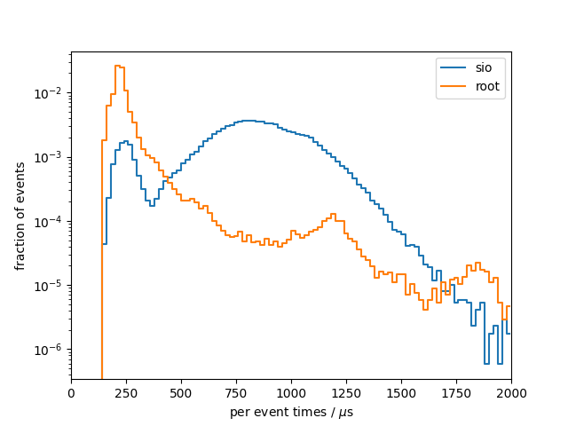
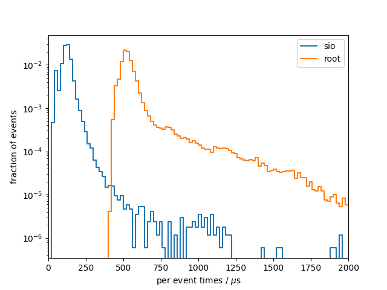

# Benchmark results
## System info
- CPU: `Intel(R) Core(TM) i7-9750H CPU @ 2.60GHz`
- Total available memory: `15992388 kB`

## write

### sio
Results from 10 benchmark runs with 17143 events each
|                          |   min    |   mean   |   max    |
|--------------------------|----------|----------|----------|
| total [s]                |    13.22 |    13.90 |    14.55 |
#### Setup times
|                          |   min    |   mean   |   max    |
|--------------------------|----------|----------|----------|
| total setup [ms]         |    4.927 |    6.059 |    10.03 |
| constructor [ms]         |    2.400 |    3.462 |    7.409 |
| finish [ms]              |    2.439 |    2.567 |    2.742 |
#### Per event times
|                          |   min    |   mean   |   max    |
|--------------------------|----------|----------|----------|
| median [us]              |    785.3 |    827.2 |    861.5 |
| min [us]                 |    147.2 |    154.7 |    158.6 |
| max [us]                 |     2032 |     2440 |     3002 |
| 90 percentile [us]       |     1069 |     1123 |     1180 |
| 99 percentile [us]       |     1318 |     1383 |     1482 |

### root
Results from 10 benchmark runs with 17143 events each
|                          |   min    |   mean   |   max    |
|--------------------------|----------|----------|----------|
| total [s]                |    6.814 |    7.340 |    8.072 |
#### Setup times
|                          |   min    |   mean   |   max    |
|--------------------------|----------|----------|----------|
| total setup [ms]         |    822.5 |    874.4 |    975.2 |
| constructor [ms]         |    28.59 |    31.88 |    41.44 |
| finish [ms]              |    787.0 |    842.5 |    946.4 |
#### Per event times
|                          |   min    |   mean   |   max    |
|--------------------------|----------|----------|----------|
| median [us]              |    212.5 |    226.0 |    246.8 |
| min [us]                 |    143.7 |    148.7 |    155.1 |
| max [us]                 | 9.39e+05 | 9.85e+05 | 1.07e+06 |
| 90 percentile [us]       |    272.8 |    331.4 |    470.3 |
| 99 percentile [us]       |     2738 |     2915 |     3119 |

### per-event comparison plot

## read

### sio
Results from 10 benchmark runs with 17143 events each
|                          |   min    |   mean   |   max    |
|--------------------------|----------|----------|----------|
| total [s]                |    4.589 |    4.713 |    4.940 |
#### Setup times
|                          |   min    |   mean   |   max    |
|--------------------------|----------|----------|----------|
| total setup [ms]         |    2.924 |    3.412 |    6.736 |
| open file [ms]           |    0.573 |    0.640 |    0.888 |
| close file [us]          |    6.536 |    8.609 |    18.21 |
| constructor [us]         |     2329 |     2763 |     5838 |
| read collection ids [us] |    0.155 |    0.201 |    0.416 |
#### Per event times
|                          |   min    |   mean   |   max    |
|--------------------------|----------|----------|----------|
| median [us]              |    271.7 |    279.2 |    291.9 |
| min [us]                 |    102.6 |    105.9 |    108.8 |
| max [us]                 |    732.6 |    865.1 |     1114 |
| 90 percentile [us]       |    337.4 |    346.5 |    364.9 |
| 99 percentile [us]       |    412.2 |    422.5 |    442.3 |

### root
Results from 10 benchmark runs with 17143 events each
|                          |   min    |   mean   |   max    |
|--------------------------|----------|----------|----------|
| total [s]                |    6.047 |    6.335 |    6.714 |
#### Setup times
|                          |   min    |   mean   |   max    |
|--------------------------|----------|----------|----------|
| total setup [ms]         |    202.5 |    215.1 |    255.6 |
| open file [ms]           |    195.6 |    208.0 |    249.0 |
| close file [us]          |     6518 |     7159 |     7808 |
| constructor [us]         |    0.371 |    0.489 |    1.160 |
| read collection ids [us] |    0.387 |    0.426 |    0.499 |
#### Per event times
|                          |   min    |   mean   |   max    |
|--------------------------|----------|----------|----------|
| median [us]              |    283.5 |    298.1 |    316.7 |
| min [us]                 |    190.0 |    199.3 |    208.9 |
| max [us]                 | 3.82e+05 | 3.89e+05 | 4.05e+05 |
| 90 percentile [us]       |    338.8 |    355.8 |    371.3 |
| 99 percentile [us]       |     1012 |     1066 |     1139 |

### per-event comparison plot

