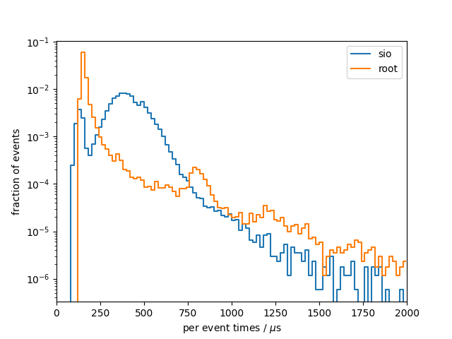
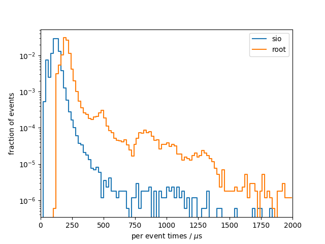

# Benchmark results
## System info
- CPU: `Intel(R) Core(TM) i7-9750H CPU @ 2.60GHz`
- Total available memory: `15991820 kB`
- ROOT version: `6.20/04`
- ROOT features `cxx17 asimage builtin_afterimage builtin_clang builtin_llvm dataframe davix exceptions gdml gsl_shared imt mathmore mlp minuit2 opengl pyroot pythia8 r roofit root7 rpath shared soversion sqlite ssl tmva unuran vc vmc vdt x11 xml xrootd`

## write

### sio
Results from 10 benchmark runs with 17143 events each

#### Wall times
| min [s]  | mean [s] |  max [s] |
|----------|----------|----------|
|    22.34 |    22.90 |    24.63 |

#### I/O times
|                          |   min    |   mean   |   max    |
|--------------------------|----------|----------|----------|
| total [s]                |    6.572 |    6.707 |    7.055 |
#### Setup times
|                          |   min    |   mean   |   max    |
|--------------------------|----------|----------|----------|
| total setup [ms]         |    3.444 |    3.884 |    7.040 |
| constructor [ms]         |    2.044 |    2.456 |    5.644 |
| finish [ms]              |    1.375 |    1.417 |    1.489 |
#### Per event times
|                          |   min    |   mean   |   max    |
|--------------------------|----------|----------|----------|
| median [us]              |    386.0 |    392.0 |    408.1 |
| min [us]                 |    84.42 |    85.60 |    86.53 |
| max [us]                 |     2276 |     2947 |     3922 |
| 90 percentile [us]       |    522.8 |    535.5 |    568.0 |
| 99 percentile [us]       |    665.8 |    707.2 |    828.4 |

### root
Results from 10 benchmark runs with 17143 events each

#### Wall times
| min [s]  | mean [s] |  max [s] |
|----------|----------|----------|
|    21.07 |    21.89 |    22.95 |

#### I/O times
|                          |   min    |   mean   |   max    |
|--------------------------|----------|----------|----------|
| total [s]                |    5.120 |    5.371 |    5.706 |
#### Setup times
|                          |   min    |   mean   |   max    |
|--------------------------|----------|----------|----------|
| total setup [ms]         |    539.3 |    558.6 |    588.7 |
| constructor [ms]         |    29.32 |    31.00 |    39.26 |
| finish [ms]              |    509.7 |    527.6 |    558.5 |
#### Per event times
|                          |   min    |   mean   |   max    |
|--------------------------|----------|----------|----------|
| median [us]              |    149.6 |    155.2 |    164.9 |
| min [us]                 |    124.7 |    129.0 |    136.7 |
| max [us]                 | 6.43e+05 | 6.76e+05 | 7.11e+05 |
| 90 percentile [us]       |    190.6 |    223.3 |    307.1 |
| 99 percentile [us]       |     2153 |     2218 |     2320 |

### per-event comparison plot

## read

### sio
Results from 10 benchmark runs with 17143 events each

#### Wall times
| min [s]  | mean [s] |  max [s] |
|----------|----------|----------|
|    3.347 |    3.475 |    3.782 |

#### I/O times
|                          |   min    |   mean   |   max    |
|--------------------------|----------|----------|----------|
| total [s]                |    1.964 |    2.034 |    2.211 |
#### Setup times
|                          |   min    |   mean   |   max    |
|--------------------------|----------|----------|----------|
| total setup [ms]         |    2.370 |    2.483 |    2.658 |
| close file [us]          |    6.663 |    8.105 |    9.663 |
| constructor [us]         |     1971 |     2064 |     2188 |
| open file [ms]           |    0.390 |    0.409 |    0.460 |
| read collection ids [us] |    0.155 |    0.243 |    0.725 |
#### Per event times
|                          |   min    |   mean   |   max    |
|--------------------------|----------|----------|----------|
| median [us]              |    116.6 |    119.3 |    126.1 |
| min [us]                 |    32.69 |    33.60 |    34.26 |
| max [us]                 |     1040 |     1435 |     2007 |
| 90 percentile [us]       |    146.2 |    151.7 |    167.4 |
| 99 percentile [us]       |    185.2 |    212.2 |    270.9 |

### root
Results from 10 benchmark runs with 17143 events each

#### Wall times
| min [s]  | mean [s] |  max [s] |
|----------|----------|----------|
|    5.974 |    6.074 |    6.208 |

#### I/O times
|                          |   min    |   mean   |   max    |
|--------------------------|----------|----------|----------|
| total [s]                |    4.541 |    4.620 |    4.707 |
#### Setup times
|                          |   min    |   mean   |   max    |
|--------------------------|----------|----------|----------|
| total setup [ms]         |    414.2 |    423.5 |    451.7 |
| close file [us]          |     7316 |     8415 | 1.12e+04 |
| constructor [us]         |    0.254 |    0.482 |    1.042 |
| open file [ms]           |    406.5 |    415.1 |    444.0 |
| read collection ids [us] |    0.376 |    0.394 |    0.427 |
#### Per event times
|                          |   min    |   mean   |   max    |
|--------------------------|----------|----------|----------|
| median [us]              |    195.8 |    200.1 |    204.0 |
| min [us]                 |    118.9 |    125.2 |    131.2 |
| max [us]                 | 2.80e+05 | 2.85e+05 | 2.89e+05 |
| 90 percentile [us]       |    241.7 |    247.0 |    256.5 |
| 99 percentile [us]       |    788.5 |    819.4 |    853.9 |

### per-event comparison plot

