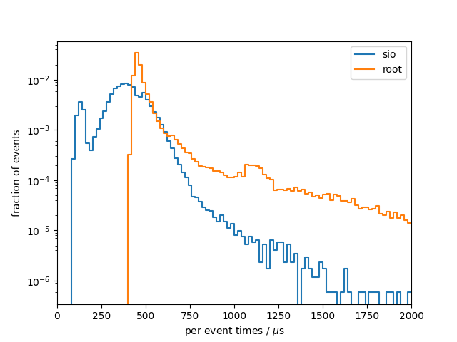
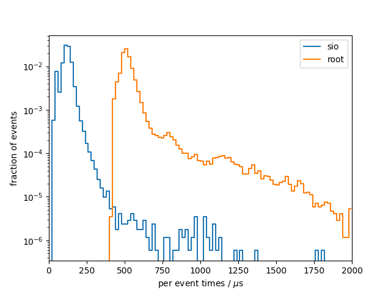

# Benchmark results
## System info
- CPU: `Intel(R) Core(TM) i7-9750H CPU @ 2.60GHz`
- Total available memory: `15991820 kB`
- ROOT version: `6.22/06`
- ROOT features `cxx17 asimage builtin_afterimage builtin_clang builtin_llvm dataframe davix exceptions gdml gsl_shared imt mathmore mlp minuit2 opengl pyroot pythia8 r roofit root7 rpath shared soversion sqlite ssl tmva tmva-rmva unuran vc vmc vdt x11 xml xrootd`

## write

### sio
Results from 10 benchmark runs with 17143 events each

#### Wall times
| min [s]  | mean [s] |  max [s] |
|----------|----------|----------|
|    23.02 |    23.45 |    24.12 |

#### I/O times
|                          |   min    |   mean   |   max    |
|--------------------------|----------|----------|----------|
| total [s]                |    6.535 |    6.629 |    6.781 |
#### Setup times
|                          |   min    |   mean   |   max    |
|--------------------------|----------|----------|----------|
| total setup [ms]         |    3.477 |    3.555 |    3.701 |
| constructor [ms]         |    2.079 |    2.124 |    2.197 |
| finish [ms]              |    1.374 |    1.420 |    1.494 |
#### Per event times
|                          |   min    |   mean   |   max    |
|--------------------------|----------|----------|----------|
| median [us]              |    385.5 |    389.0 |    395.8 |
| min [us]                 |    84.74 |    85.55 |    87.03 |
| max [us]                 |     1481 |     2344 |     2739 |
| 90 percentile [us]       |    521.6 |    529.1 |    542.0 |
| 99 percentile [us]       |    644.2 |    679.3 |    734.1 |

### root
Results from 10 benchmark runs with 17143 events each

#### Wall times
| min [s]  | mean [s] |  max [s] |
|----------|----------|----------|
|    26.91 |    29.33 |    36.13 |

#### I/O times
|                          |   min    |   mean   |   max    |
|--------------------------|----------|----------|----------|
| total [s]                |    10.07 |    11.11 |    13.81 |
#### Setup times
|                          |   min    |   mean   |   max    |
|--------------------------|----------|----------|----------|
| total setup [ms]         |    445.0 |    472.0 |    528.0 |
| constructor [ms]         |    24.59 |    29.71 |    53.64 |
| finish [ms]              |    420.3 |    442.3 |    502.4 |
#### Per event times
|                          |   min    |   mean   |   max    |
|--------------------------|----------|----------|----------|
| median [us]              |    441.5 |    466.8 |    533.4 |
| min [us]                 |    406.7 |    416.9 |    427.1 |
| max [us]                 | 6.40e+05 | 6.66e+05 | 7.45e+05 |
| 90 percentile [us]       |    504.8 |    636.1 |     1135 |
| 99 percentile [us]       |     2453 |     2644 |     3165 |

### per-event comparison plot

## read

### sio
Results from 10 benchmark runs with 17143 events each

#### Wall times
| min [s]  | mean [s] |  max [s] |
|----------|----------|----------|
|    3.398 |    3.471 |    3.626 |

#### I/O times
|                          |   min    |   mean   |   max    |
|--------------------------|----------|----------|----------|
| total [s]                |    1.982 |    2.017 |    2.101 |
#### Setup times
|                          |   min    |   mean   |   max    |
|--------------------------|----------|----------|----------|
| total setup [ms]         |    2.378 |    2.793 |    5.932 |
| close file [us]          |    6.337 |    8.031 |    9.891 |
| constructor [us]         |     1969 |     2351 |     5289 |
| read collection ids [us] |    0.165 |    0.189 |    0.259 |
| open file [ms]           |    0.393 |    0.432 |    0.631 |
#### Per event times
|                          |   min    |   mean   |   max    |
|--------------------------|----------|----------|----------|
| median [us]              |    117.0 |    118.4 |    121.1 |
| min [us]                 |    32.69 |    33.51 |    34.74 |
| max [us]                 |     1035 |     1364 |     2009 |
| 90 percentile [us]       |    146.9 |    150.7 |    159.8 |
| 99 percentile [us]       |    192.6 |    209.6 |    257.6 |

### root
Results from 10 benchmark runs with 17143 events each

#### Wall times
| min [s]  | mean [s] |  max [s] |
|----------|----------|----------|
|    11.29 |    11.70 |    12.20 |

#### I/O times
|                          |   min    |   mean   |   max    |
|--------------------------|----------|----------|----------|
| total [s]                |    9.845 |    10.21 |    10.62 |
#### Setup times
|                          |   min    |   mean   |   max    |
|--------------------------|----------|----------|----------|
| total setup [ms]         |    435.0 |    468.6 |    541.7 |
| close file [us]          |     6786 |     8817 | 1.45e+04 |
| constructor [us]         |    0.320 |    0.383 |    0.700 |
| read collection ids [us] |    0.397 |    0.557 |    1.473 |
| open file [ms]           |    426.8 |    459.8 |    534.4 |
#### Per event times
|                          |   min    |   mean   |   max    |
|--------------------------|----------|----------|----------|
| median [us]              |    499.9 |    512.8 |    535.1 |
| min [us]                 |    414.6 |    423.7 |    439.5 |
| max [us]                 | 2.94e+05 | 3.04e+05 | 3.49e+05 |
| 90 percentile [us]       |    559.5 |    581.8 |    618.1 |
| 99 percentile [us]       |     1118 |     1217 |     1335 |

### per-event comparison plot

