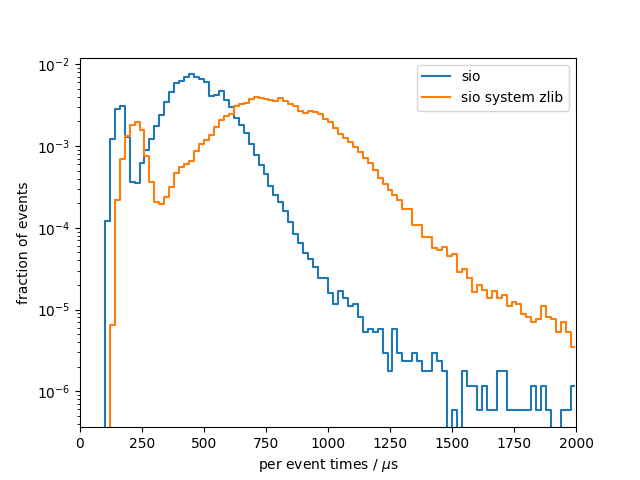
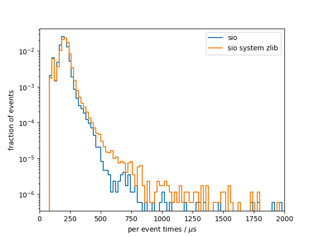

# Benchmark results
## System info
- CPU: `Intel(R) Core(TM) i7-9750H CPU @ 2.60GHz`
- Total available memory: `15991820 kB`

## write

### sio
Results from 10 benchmark runs with 17143 events each
|                          |   min    |   mean   |   max    |
|--------------------------|----------|----------|----------|
| total [s]                |    7.697 |    7.797 |    8.010 |
#### Setup times
|                          |   min    |   mean   |   max    |
|--------------------------|----------|----------|----------|
| total setup [ms]         |    3.924 |    4.505 |    8.576 |
| constructor [ms]         |    2.475 |    3.026 |    7.055 |
| finish [ms]              |    1.380 |    1.454 |    1.625 |
#### Per event times
|                          |   min    |   mean   |   max    |
|--------------------------|----------|----------|----------|
| median [us]              |    453.0 |    457.7 |    463.8 |
| min [us]                 |    109.3 |    110.0 |    111.3 |
| max [us]                 |     1243 |     2695 |     4646 |
| 90 percentile [us]       |    608.6 |    619.4 |    640.7 |
| 99 percentile [us]       |    765.5 |    800.1 |    920.4 |

### sio system zlib
Results from 10 benchmark runs with 17143 events each
|                          |   min    |   mean   |   max    |
|--------------------------|----------|----------|----------|
| total [s]                |    12.61 |    12.87 |    13.45 |
#### Setup times
|                          |   min    |   mean   |   max    |
|--------------------------|----------|----------|----------|
| total setup [ms]         |    4.933 |    5.806 |    9.980 |
| constructor [ms]         |    2.433 |    3.050 |    7.386 |
| finish [ms]              |    2.398 |    2.731 |    3.878 |
#### Per event times
|                          |   min    |   mean   |   max    |
|--------------------------|----------|----------|----------|
| median [us]              |    748.8 |    760.1 |    783.6 |
| min [us]                 |    136.6 |    138.8 |    141.6 |
| max [us]                 |     2919 |     3959 |     8283 |
| 90 percentile [us]       |     1021 |     1045 |     1106 |
| 99 percentile [us]       |     1264 |     1354 |     1546 |

### per-event comparison plot

## read

### sio
Results from 10 benchmark runs with 17143 events each
|                          |   min    |   mean   |   max    |
|--------------------------|----------|----------|----------|
| total [s]                |    3.306 |    3.348 |    3.412 |
#### Setup times
|                          |   min    |   mean   |   max    |
|--------------------------|----------|----------|----------|
| total setup [ms]         |    2.782 |    2.900 |    3.123 |
| open file [ms]           |    0.396 |    0.413 |    0.464 |
| read collection ids [us] |    0.151 |    0.191 |    0.250 |
| close file [us]          |    7.335 |    8.526 |    10.03 |
| constructor [us]         |     2365 |     2478 |     2716 |
#### Per event times
|                          |   min    |   mean   |   max    |
|--------------------------|----------|----------|----------|
| median [us]              |    195.0 |    196.5 |    197.8 |
| min [us]                 |    82.56 |    83.57 |    85.50 |
| max [us]                 |    652.0 |    984.8 |     1976 |
| 90 percentile [us]       |    235.6 |    238.9 |    244.4 |
| 99 percentile [us]       |    304.0 |    327.8 |    371.3 |

### sio system zlib
Results from 10 benchmark runs with 17143 events each
|                          |   min    |   mean   |   max    |
|--------------------------|----------|----------|----------|
| total [s]                |    3.397 |    3.519 |    3.758 |
#### Setup times
|                          |   min    |   mean   |   max    |
|--------------------------|----------|----------|----------|
| total setup [ms]         |    2.825 |    2.908 |    3.141 |
| open file [ms]           |    0.424 |    0.452 |    0.486 |
| read collection ids [us] |    0.167 |    0.225 |    0.319 |
| close file [us]          |    6.682 |    9.343 |    20.22 |
| constructor [us]         |     2375 |     2445 |     2646 |
#### Per event times
|                          |   min    |   mean   |   max    |
|--------------------------|----------|----------|----------|
| median [us]              |    200.6 |    205.3 |    213.4 |
| min [us]                 |    83.02 |    85.50 |    88.12 |
| max [us]                 |    673.7 |     1459 |     2403 |
| 90 percentile [us]       |    242.9 |    253.1 |    276.3 |
| 99 percentile [us]       |    315.8 |    360.8 |    467.3 |

### per-event comparison plot

