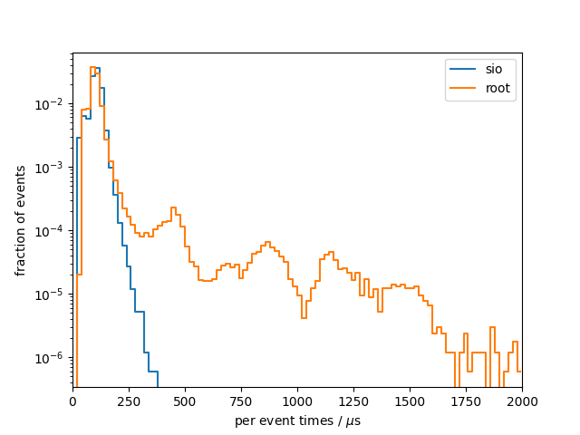

# Benchmark results
## System info
- CPU: `Intel(R) Core(TM) i7-9750H CPU @ 2.60GHz`
- Total available memory: `15991728 kB`
- ROOT version: `6.22/08`
- ROOT features `cxx17 asimage builtin_afterimage builtin_clang builtin_llvm dataframe davix exceptions gdml gsl_shared imt mathmore mlp minuit2 opengl pyroot pythia8 r roofit root7 rpath shared soversion sqlite ssl tmva tmva-rmva unuran vc vmc vdt x11 xml xrootd`

## write

### sio
Results from 10 benchmark runs with 17143 events each

#### Wall times
| min [s]  | mean [s] |  max [s] |
|----------|----------|----------|
|    19.70 |    19.95 |    20.48 |

#### I/O times
|                          |   min    |   mean   |   max    |
|--------------------------|----------|----------|----------|
| total [s]                |    6.109 |    6.177 |    6.341 |
#### Setup times
|                          |   min    |   mean   |   max    |
|--------------------------|----------|----------|----------|
| total setup [ms]         |    3.250 |    3.345 |    3.425 |
| constructor [ms]         |    1.933 |    1.986 |    2.065 |
| finish [ms]              |    1.305 |    1.349 |    1.395 |
#### Per event times
|                          |   min    |   mean   |   max    |
|--------------------------|----------|----------|----------|
| median [us]              |    362.0 |    365.7 |    375.8 |
| min [us]                 |    78.84 |    80.29 |    82.83 |
| max [us]                 |    922.2 |     1184 |     1575 |
| 90 percentile [us]       |    487.3 |    492.3 |    505.6 |
| 99 percentile [us]       |    594.5 |    605.9 |    623.6 |

### root
Results from 10 benchmark runs with 17143 events each

#### Wall times
| min [s]  | mean [s] |  max [s] |
|----------|----------|----------|
|    17.96 |    18.39 |    19.03 |

#### I/O times
|                          |   min    |   mean   |   max    |
|--------------------------|----------|----------|----------|
| total [s]                |    4.278 |    4.401 |    4.542 |
#### Setup times
|                          |   min    |   mean   |   max    |
|--------------------------|----------|----------|----------|
| total setup [ms]         |    773.6 |    791.6 |    817.8 |
| constructor [ms]         |    24.06 |    26.52 |    33.95 |
| finish [ms]              |    748.8 |    765.1 |    793.1 |
#### Per event times
|                          |   min    |   mean   |   max    |
|--------------------------|----------|----------|----------|
| median [us]              |    56.61 |    59.11 |    63.44 |
| min [us]                 |    38.45 |    40.15 |    43.51 |
| max [us]                 | 9.72e+05 | 9.94e+05 | 1.02e+06 |
| 90 percentile [us]       |    77.70 |    86.18 |    95.72 |
| 99 percentile [us]       |     2241 |     2314 |     2417 |

### per-event comparison plot

## read

### sio
Results from 10 benchmark runs with 17143 events each

#### Wall times
| min [s]  | mean [s] |  max [s] |
|----------|----------|----------|
|    2.683 |    2.711 |    2.756 |

#### I/O times
|                          |   min    |   mean   |   max    |
|--------------------------|----------|----------|----------|
| total [s]                |    1.742 |    1.760 |    1.786 |
#### Setup times
|                          |   min    |   mean   |   max    |
|--------------------------|----------|----------|----------|
| total setup [ms]         |    2.234 |    3.027 |    5.903 |
| constructor [us]         |     1833 |     2582 |     5260 |
| read collection ids [us] |    0.103 |    0.133 |    0.213 |
| open file [ms]           |    0.383 |    0.436 |    0.633 |
| close file [us]          |    5.877 |    7.195 |    8.684 |
#### Per event times
|                          |   min    |   mean   |   max    |
|--------------------------|----------|----------|----------|
| median [us]              |    103.6 |    104.7 |    105.8 |
| min [us]                 |    28.21 |    28.63 |    29.11 |
| max [us]                 |    257.7 |    308.1 |    362.5 |
| 90 percentile [us]       |    130.3 |    131.6 |    133.5 |
| 99 percentile [us]       |    163.0 |    169.5 |    177.5 |

### root
Results from 10 benchmark runs with 17143 events each

#### Wall times
| min [s]  | mean [s] |  max [s] |
|----------|----------|----------|
|    3.842 |    3.931 |    4.111 |

#### I/O times
|                          |   min    |   mean   |   max    |
|--------------------------|----------|----------|----------|
| total [s]                |    2.946 |    3.010 |    3.129 |
#### Setup times
|                          |   min    |   mean   |   max    |
|--------------------------|----------|----------|----------|
| total setup [ms]         |    419.8 |    427.2 |    446.3 |
| constructor [us]         | 3.90e-02 | 4.61e-02 | 5.10e-02 |
| read collection ids [us] |    0.160 |    0.208 |    0.537 |
| open file [ms]           |    411.0 |    418.0 |    436.1 |
| close file [us]          |     7731 |     9144 | 1.02e+04 |
#### Per event times
|                          |   min    |   mean   |   max    |
|--------------------------|----------|----------|----------|
| median [us]              |    96.17 |    98.56 |    103.5 |
| min [us]                 |    37.48 |    39.15 |    42.69 |
| max [us]                 | 3.40e+05 | 3.46e+05 | 3.53e+05 |
| 90 percentile [us]       |    127.9 |    132.9 |    139.7 |
| 99 percentile [us]       |    767.6 |    796.3 |    831.0 |

### per-event comparison plot

