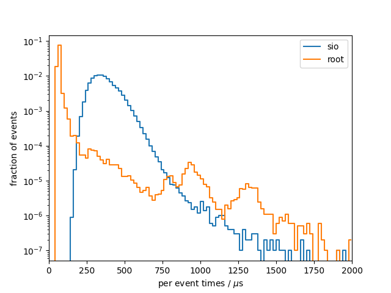
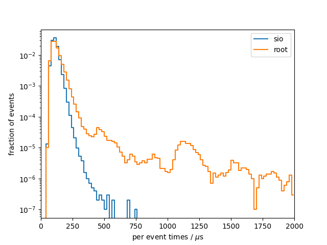

# Benchmark results
## System info
- CPU: `Intel(R) Core(TM) i7-9750H CPU @ 2.60GHz`
- Total available memory: `15991728 kB`
- ROOT version: `6.22/08`
- ROOT features `cxx17 asimage builtin_afterimage builtin_clang builtin_llvm dataframe davix exceptions gdml gsl_shared imt mathmore mlp minuit2 opengl pyroot pythia8 r roofit root7 rpath shared soversion sqlite ssl tmva tmva-rmva unuran vc vmc vdt x11 xml xrootd`

## write

### sio
Results from 10 benchmark runs with 100000 events each

#### Wall times
| min [s]  | mean [s] |  max [s] |
|----------|----------|----------|
|    142.4 |    143.7 |    146.9 |

#### I/O times
|                          |   min    |   mean   |   max    |
|--------------------------|----------|----------|----------|
| total [s]                |    36.39 |    36.70 |    37.46 |
#### Setup times
|                          |   min    |   mean   |   max    |
|--------------------------|----------|----------|----------|
| total setup [ms]         |    10.09 |    10.93 |    13.31 |
| constructor [ms]         |    1.857 |    2.520 |    4.839 |
| finish [ms]              |    8.177 |    8.402 |    8.694 |
#### Per event times
|                          |   min    |   mean   |   max    |
|--------------------------|----------|----------|----------|
| median [us]              |    352.4 |    355.6 |    363.2 |
| min [us]                 |    156.2 |    159.0 |    162.0 |
| max [us]                 |     1340 |     3067 | 1.34e+04 |
| 90 percentile [us]       |    472.6 |    477.1 |    487.1 |
| 99 percentile [us]       |    596.3 |    603.1 |    614.5 |

### root
Results from 10 benchmark runs with 100000 events each

#### Wall times
| min [s]  | mean [s] |  max [s] |
|----------|----------|----------|
|    131.5 |    133.9 |    135.4 |

#### I/O times
|                          |   min    |   mean   |   max    |
|--------------------------|----------|----------|----------|
| total [s]                |    24.92 |    25.36 |    25.81 |
#### Setup times
|                          |   min    |   mean   |   max    |
|--------------------------|----------|----------|----------|
| total setup [ms]         |    875.7 |    897.5 |    930.4 |
| constructor [ms]         |    23.88 |    26.46 |    36.90 |
| finish [ms]              |    843.3 |    871.0 |    905.7 |
#### Per event times
|                          |   min    |   mean   |   max    |
|--------------------------|----------|----------|----------|
| median [us]              |    62.75 |    64.73 |    66.93 |
| min [us]                 |    46.44 |    49.03 |    51.00 |
| max [us]                 | 9.63e+05 | 9.84e+05 | 1.01e+06 |
| 90 percentile [us]       |    73.38 |    75.66 |    77.87 |
| 99 percentile [us]       |    281.6 |    304.8 |    315.9 |

### per-event comparison plot

## read

### sio
Results from 10 benchmark runs with 100000 events each

#### Wall times
| min [s]  | mean [s] |  max [s] |
|----------|----------|----------|
|    16.85 |    17.30 |    17.55 |

#### I/O times
|                          |   min    |   mean   |   max    |
|--------------------------|----------|----------|----------|
| total [s]                |    10.86 |    11.13 |    11.30 |
#### Setup times
|                          |   min    |   mean   |   max    |
|--------------------------|----------|----------|----------|
| total setup [ms]         |    3.644 |    4.210 |    8.071 |
| constructor [us]         |     1881 |     2281 |     5226 |
| read collection ids [us] |    0.101 |    0.139 |    0.319 |
| open file [ms]           |    1.754 |    1.919 |    2.835 |
| close file [us]          |    6.294 |    7.781 |    8.282 |
#### Per event times
|                          |   min    |   mean   |   max    |
|--------------------------|----------|----------|----------|
| median [us]              |    104.8 |    107.4 |    109.0 |
| min [us]                 |    53.44 |    55.25 |    57.13 |
| max [us]                 |    339.9 |    466.1 |    742.7 |
| 90 percentile [us]       |    137.8 |    141.3 |    143.5 |
| 99 percentile [us]       |    180.3 |    185.5 |    188.1 |

### root
Results from 10 benchmark runs with 100000 events each

#### Wall times
| min [s]  | mean [s] |  max [s] |
|----------|----------|----------|
|    22.69 |    23.08 |    23.64 |

#### I/O times
|                          |   min    |   mean   |   max    |
|--------------------------|----------|----------|----------|
| total [s]                |    16.72 |    17.00 |    17.45 |
#### Setup times
|                          |   min    |   mean   |   max    |
|--------------------------|----------|----------|----------|
| total setup [ms]         |    423.5 |    432.3 |    465.7 |
| constructor [us]         | 4.50e-02 | 6.56e-02 |    0.162 |
| read collection ids [us] |    0.115 |    0.193 |    0.263 |
| open file [ms]           |    415.1 |    423.6 |    456.6 |
| close file [us]          |     7442 |     8706 |     9235 |
#### Per event times
|                          |   min    |   mean   |   max    |
|--------------------------|----------|----------|----------|
| median [us]              |    108.3 |    110.5 |    114.2 |
| min [us]                 |    54.77 |    56.28 |    58.43 |
| max [us]                 | 3.42e+05 | 3.46e+05 | 3.52e+05 |
| 90 percentile [us]       |    162.1 |    166.0 |    171.0 |
| 99 percentile [us]       |    263.9 |    274.0 |    291.4 |

### per-event comparison plot

