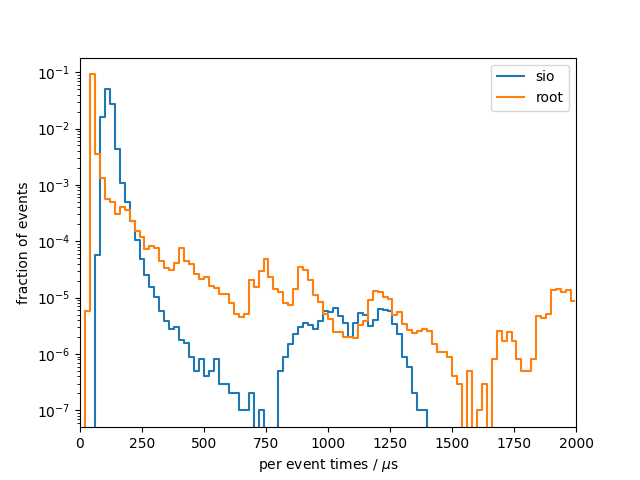
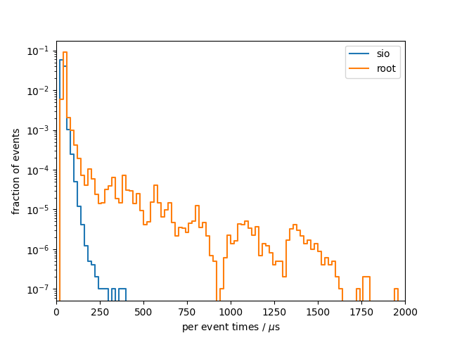

# Benchmark results
## System info
- CPU: `Intel(R) Core(TM) i7-9750H CPU @ 2.60GHz`
- Total available memory: `15991728 kB`
- ROOT version: `6.22/08`
- ROOT features `cxx17 asimage builtin_afterimage builtin_clang builtin_llvm dataframe davix exceptions gdml gsl_shared imt mathmore mlp minuit2 opengl pyroot pythia8 r roofit root7 rpath shared soversion sqlite ssl tmva tmva-rmva unuran vc vmc vdt x11 xml xrootd`

## write

### sio
Results from 10 benchmark runs with 100000 events each

#### Wall times
| min [s]  | mean [s] |  max [s] |
|----------|----------|----------|
|     1225 |     1228 |     1232 |

#### I/O times
|                          |   min    |   mean   |   max    |
|--------------------------|----------|----------|----------|
| total [s]                |    11.62 |    11.66 |    11.70 |
#### Setup times
|                          |   min    |   mean   |   max    |
|--------------------------|----------|----------|----------|
| total setup [ms]         |    10.09 |    11.08 |    13.48 |
| constructor [ms]         |    1.896 |    2.766 |    4.759 |
| finish [ms]              |    8.038 |    8.299 |    8.773 |
#### Per event times
|                          |   min    |   mean   |   max    |
|--------------------------|----------|----------|----------|
| median [us]              |    113.7 |    113.9 |    114.3 |
| min [us]                 |    68.84 |    70.42 |    72.42 |
| max [us]                 |     1301 |     1335 |     1394 |
| 90 percentile [us]       |    134.2 |    134.5 |    134.9 |
| 99 percentile [us]       |    179.4 |    181.3 |    182.6 |

### root
Results from 10 benchmark runs with 100000 events each

#### Wall times
| min [s]  | mean [s] |  max [s] |
|----------|----------|----------|
|     1224 |     1226 |     1230 |

#### I/O times
|                          |   min    |   mean   |   max    |
|--------------------------|----------|----------|----------|
| total [s]                |    9.234 |    9.330 |    9.465 |
#### Setup times
|                          |   min    |   mean   |   max    |
|--------------------------|----------|----------|----------|
| total setup [ms]         |    438.0 |    448.7 |    465.0 |
| constructor [ms]         |    23.73 |    25.42 |    32.84 |
| finish [ms]              |    413.6 |    423.2 |    440.3 |
#### Per event times
|                          |   min    |   mean   |   max    |
|--------------------------|----------|----------|----------|
| median [us]              |    47.55 |    48.41 |    49.26 |
| min [us]                 |    39.03 |    40.23 |    41.76 |
| max [us]                 | 1.05e+06 | 1.06e+06 | 1.10e+06 |
| 90 percentile [us]       |    55.81 |    56.94 |    59.46 |
| 99 percentile [us]       |    360.9 |    376.7 |    403.6 |

### per-event comparison plot

## read

### sio
Results from 10 benchmark runs with 100000 events each

#### Wall times
| min [s]  | mean [s] |  max [s] |
|----------|----------|----------|
|    5.551 |    5.688 |    5.806 |

#### I/O times
|                          |   min    |   mean   |   max    |
|--------------------------|----------|----------|----------|
| total [s]                |    3.754 |    3.845 |    3.927 |
#### Setup times
|                          |   min    |   mean   |   max    |
|--------------------------|----------|----------|----------|
| total setup [ms]         |    3.798 |    4.465 |    8.683 |
| constructor [us]         |     1842 |     2309 |     5656 |
| open file [ms]           |    1.947 |    2.145 |    3.018 |
| read collection ids [us] | 1.00e-01 |    0.125 |    0.244 |
| close file [us]          |    6.964 |    8.845 |    21.21 |
#### Per event times
|                          |   min    |   mean   |   max    |
|--------------------------|----------|----------|----------|
| median [us]              |    37.99 |    38.82 |    39.51 |
| min [us]                 |    24.06 |    24.59 |    25.06 |
| max [us]                 |    147.0 |    209.6 |    382.5 |
| 90 percentile [us]       |    43.42 |    44.48 |    45.47 |
| 99 percentile [us]       |    60.19 |    64.39 |    69.88 |

### root
Results from 10 benchmark runs with 100000 events each

#### Wall times
| min [s]  | mean [s] |  max [s] |
|----------|----------|----------|
|    7.773 |    7.971 |    8.137 |

#### I/O times
|                          |   min    |   mean   |   max    |
|--------------------------|----------|----------|----------|
| total [s]                |    5.979 |    6.155 |    6.322 |
#### Setup times
|                          |   min    |   mean   |   max    |
|--------------------------|----------|----------|----------|
| total setup [ms]         |    419.5 |    431.6 |    478.6 |
| constructor [us]         | 3.80e-02 | 4.67e-02 | 5.40e-02 |
| open file [ms]           |    412.5 |    424.6 |    471.9 |
| read collection ids [us] |    0.131 |    0.203 |    0.448 |
| close file [us]          |     6305 |     7025 |     7938 |
#### Per event times
|                          |   min    |   mean   |   max    |
|--------------------------|----------|----------|----------|
| median [us]              |    42.81 |    44.61 |    45.87 |
| min [us]                 |    33.50 |    35.19 |    36.58 |
| max [us]                 | 3.27e+05 | 3.33e+05 | 3.53e+05 |
| 90 percentile [us]       |    48.16 |    49.96 |    51.71 |
| 99 percentile [us]       |    122.6 |    126.0 |    129.7 |

### per-event comparison plot

