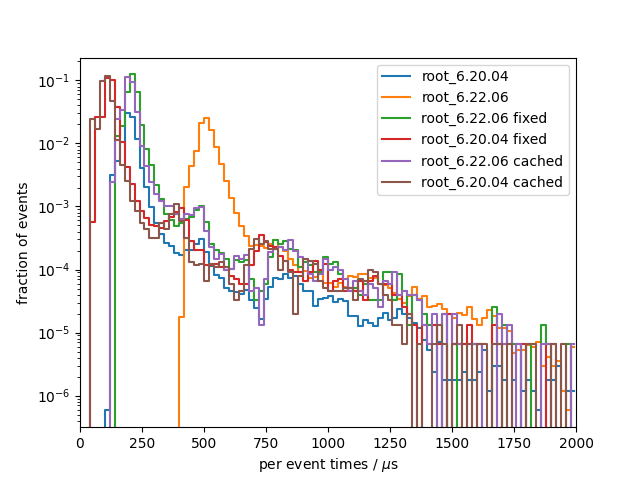

# Benchmark results
## System info
- CPU: `Intel(R) Core(TM) i7-9750H CPU @ 2.60GHz`
- Total available memory: `15991820 kB`
- ROOT version: `6.20/04 6.22.06`
- ROOT features `N/A`

## write

### sio
Results from 10 benchmark runs with 17143 events each

#### I/O times
|                          |   min    |   mean   |   max    |
|--------------------------|----------|----------|----------|
| total [s]                |    6.572 |    6.707 |    7.055 |
#### Setup times
|                          |   min    |   mean   |   max    |
|--------------------------|----------|----------|----------|
| total setup [ms]         |    3.444 |    3.884 |    7.040 |
| constructor [ms]         |    2.044 |    2.456 |    5.644 |
| finish [ms]              |    1.375 |    1.417 |    1.489 |
#### Per event times
|                          |   min    |   mean   |   max    |
|--------------------------|----------|----------|----------|
| median [us]              |    386.0 |    392.0 |    408.1 |
| min [us]                 |    84.42 |    85.60 |    86.53 |
| max [us]                 |     2276 |     2947 |     3922 |
| 90 percentile [us]       |    522.8 |    535.5 |    568.0 |
| 99 percentile [us]       |    665.8 |    707.2 |    828.4 |

### root_6.20.04
Results from 10 benchmark runs with 17143 events each

#### I/O times
|                          |   min    |   mean   |   max    |
|--------------------------|----------|----------|----------|
| total [s]                |    5.120 |    5.371 |    5.706 |
#### Setup times
|                          |   min    |   mean   |   max    |
|--------------------------|----------|----------|----------|
| total setup [ms]         |    539.3 |    558.6 |    588.7 |
| constructor [ms]         |    29.32 |    31.00 |    39.26 |
| finish [ms]              |    509.7 |    527.6 |    558.5 |
#### Per event times
|                          |   min    |   mean   |   max    |
|--------------------------|----------|----------|----------|
| median [us]              |    149.6 |    155.2 |    164.9 |
| min [us]                 |    124.7 |    129.0 |    136.7 |
| max [us]                 | 6.43e+05 | 6.76e+05 | 7.11e+05 |
| 90 percentile [us]       |    190.6 |    223.3 |    307.1 |
| 99 percentile [us]       |     2153 |     2218 |     2320 |

### root_6.22.06
Results from 10 benchmark runs with 17143 events each

#### I/O times
|                          |   min    |   mean   |   max    |
|--------------------------|----------|----------|----------|
| total [s]                |    10.07 |    11.11 |    13.81 |
#### Setup times
|                          |   min    |   mean   |   max    |
|--------------------------|----------|----------|----------|
| total setup [ms]         |    445.0 |    472.0 |    528.0 |
| constructor [ms]         |    24.59 |    29.71 |    53.64 |
| finish [ms]              |    420.3 |    442.3 |    502.4 |
#### Per event times
|                          |   min    |   mean   |   max    |
|--------------------------|----------|----------|----------|
| median [us]              |    441.5 |    466.8 |    533.4 |
| min [us]                 |    406.7 |    416.9 |    427.1 |
| max [us]                 | 6.40e+05 | 6.66e+05 | 7.45e+05 |
| 90 percentile [us]       |    504.8 |    636.1 |     1135 |
| 99 percentile [us]       |     2453 |     2644 |     3165 |

### per-event comparison plot

## read

### sio
Results from 10 benchmark runs with 17143 events each

#### I/O times
|                          |   min    |   mean   |   max    |
|--------------------------|----------|----------|----------|
| total [s]                |    1.964 |    2.034 |    2.211 |
#### Setup times
|                          |   min    |   mean   |   max    |
|--------------------------|----------|----------|----------|
| total setup [ms]         |    2.370 |    2.483 |    2.658 |
| close file [us]          |    6.663 |    8.105 |    9.663 |
| open file [ms]           |    0.390 |    0.409 |    0.460 |
| constructor [us]         |     1971 |     2064 |     2188 |
| read collection ids [us] |    0.155 |    0.243 |    0.725 |
#### Per event times
|                          |   min    |   mean   |   max    |
|--------------------------|----------|----------|----------|
| median [us]              |    116.6 |    119.3 |    126.1 |
| min [us]                 |    32.69 |    33.60 |    34.26 |
| max [us]                 |     1040 |     1435 |     2007 |
| 90 percentile [us]       |    146.2 |    151.7 |    167.4 |
| 99 percentile [us]       |    185.2 |    212.2 |    270.9 |

### root_6.20.04
Results from 10 benchmark runs with 17143 events each

#### I/O times
|                          |   min    |   mean   |   max    |
|--------------------------|----------|----------|----------|
| total [s]                |    4.541 |    4.620 |    4.707 |
#### Setup times
|                          |   min    |   mean   |   max    |
|--------------------------|----------|----------|----------|
| total setup [ms]         |    414.2 |    423.5 |    451.7 |
| close file [us]          |     7316 |     8415 | 1.12e+04 |
| open file [ms]           |    406.5 |    415.1 |    444.0 |
| constructor [us]         |    0.254 |    0.482 |    1.042 |
| read collection ids [us] |    0.376 |    0.394 |    0.427 |
#### Per event times
|                          |   min    |   mean   |   max    |
|--------------------------|----------|----------|----------|
| median [us]              |    195.8 |    200.1 |    204.0 |
| min [us]                 |    118.9 |    125.2 |    131.2 |
| max [us]                 | 2.80e+05 | 2.85e+05 | 2.89e+05 |
| 90 percentile [us]       |    241.7 |    247.0 |    256.5 |
| 99 percentile [us]       |    788.5 |    819.4 |    853.9 |

### root_6.22.06
Results from 10 benchmark runs with 17143 events each

#### I/O times
|                          |   min    |   mean   |   max    |
|--------------------------|----------|----------|----------|
| total [s]                |    9.845 |    10.21 |    10.62 |
#### Setup times
|                          |   min    |   mean   |   max    |
|--------------------------|----------|----------|----------|
| total setup [ms]         |    435.0 |    468.6 |    541.7 |
| close file [us]          |     6786 |     8817 | 1.45e+04 |
| open file [ms]           |    426.8 |    459.8 |    534.4 |
| constructor [us]         |    0.320 |    0.383 |    0.700 |
| read collection ids [us] |    0.397 |    0.557 |    1.473 |
#### Per event times
|                          |   min    |   mean   |   max    |
|--------------------------|----------|----------|----------|
| median [us]              |    499.9 |    512.8 |    535.1 |
| min [us]                 |    414.6 |    423.7 |    439.5 |
| max [us]                 | 2.94e+05 | 3.04e+05 | 3.49e+05 |
| 90 percentile [us]       |    559.5 |    581.8 |    618.1 |
| 99 percentile [us]       |     1118 |     1217 |     1335 |

### per-event comparison plot

