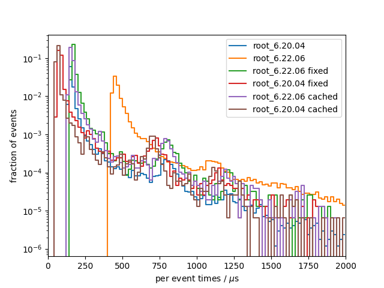

# Benchmark results
## System info
- CPU: `Intel(R) Core(TM) i7-9750H CPU @ 2.60GHz`
- Total available memory: `15991820 kB`
- ROOT version: `6.20/04 6.22.06`
- ROOT features `N/A`

## write

### root_6.20.04
Results from 10 benchmark runs with 17143 events each

#### I/O times
|                          |   min    |   mean   |   max    |
|--------------------------|----------|----------|----------|
| total [s]                |    5.120 |    5.371 |    5.706 |
#### Setup times
|                          |   min    |   mean   |   max    |
|--------------------------|----------|----------|----------|
| total setup [ms]         |    539.3 |    558.6 |    588.7 |
| constructor [ms]         |    29.32 |    31.00 |    39.26 |
| finish [ms]              |    509.7 |    527.6 |    558.5 |
#### Per event times
|                          |   min    |   mean   |   max    |
|--------------------------|----------|----------|----------|
| median [us]              |    149.6 |    155.2 |    164.9 |
| min [us]                 |    124.7 |    129.0 |    136.7 |
| max [us]                 | 6.43e+05 | 6.76e+05 | 7.11e+05 |
| 90 percentile [us]       |    190.6 |    223.3 |    307.1 |
| 99 percentile [us]       |     2153 |     2218 |     2320 |

### root_6.22.06
Results from 10 benchmark runs with 17143 events each

#### I/O times
|                          |   min    |   mean   |   max    |
|--------------------------|----------|----------|----------|
| total [s]                |    10.07 |    11.11 |    13.81 |
#### Setup times
|                          |   min    |   mean   |   max    |
|--------------------------|----------|----------|----------|
| total setup [ms]         |    445.0 |    472.0 |    528.0 |
| constructor [ms]         |    24.59 |    29.71 |    53.64 |
| finish [ms]              |    420.3 |    442.3 |    502.4 |
#### Per event times
|                          |   min    |   mean   |   max    |
|--------------------------|----------|----------|----------|
| median [us]              |    441.5 |    466.8 |    533.4 |
| min [us]                 |    406.7 |    416.9 |    427.1 |
| max [us]                 | 6.40e+05 | 6.66e+05 | 7.45e+05 |
| 90 percentile [us]       |    504.8 |    636.1 |     1135 |
| 99 percentile [us]       |     2453 |     2644 |     3165 |

### root_6.22.06 fixed
Results from 3 benchmark runs with 17143 events each

#### I/O times
|                          |   min    |   mean   |   max    |
|--------------------------|----------|----------|----------|
| total [s]                |    5.339 |    5.377 |    5.406 |
#### Setup times
|                          |   min    |   mean   |   max    |
|--------------------------|----------|----------|----------|
| total setup [ms]         |    456.2 |    466.2 |    475.6 |
| constructor [ms]         |    31.02 |    31.62 |    32.71 |
| finish [ms]              |    425.2 |    434.6 |    444.4 |
#### Per event times
|                          |   min    |   mean   |   max    |
|--------------------------|----------|----------|----------|
| median [us]              |    170.5 |    172.5 |    174.5 |
| min [us]                 |    146.1 |    147.0 |    147.5 |
| max [us]                 | 6.38e+05 | 6.46e+05 | 6.55e+05 |
| 90 percentile [us]       |    210.2 |    215.1 |    219.3 |
| 99 percentile [us]       |     2151 |     2180 |     2220 |

### root_6.20.04 fixed
Results from 3 benchmark runs with 17143 events each

#### I/O times
|                          |   min    |   mean   |   max    |
|--------------------------|----------|----------|----------|
| total [s]                |    3.841 |    3.958 |    4.104 |
#### Setup times
|                          |   min    |   mean   |   max    |
|--------------------------|----------|----------|----------|
| total setup [ms]         |    558.9 |    562.3 |    567.0 |
| constructor [ms]         |    28.94 |    30.98 |    34.23 |
| finish [ms]              |    526.8 |    531.3 |    537.2 |
#### Per event times
|                          |   min    |   mean   |   max    |
|--------------------------|----------|----------|----------|
| median [us]              |    77.25 |    80.09 |    81.92 |
| min [us]                 |    53.34 |    57.31 |    60.05 |
| max [us]                 | 6.47e+05 | 6.74e+05 | 7.06e+05 |
| 90 percentile [us]       |    116.2 |    126.8 |    144.7 |
| 99 percentile [us]       |     2088 |     2108 |     2133 |

### per-event comparison plot

## read

### root_6.20.04
Results from 10 benchmark runs with 17143 events each

#### I/O times
|                          |   min    |   mean   |   max    |
|--------------------------|----------|----------|----------|
| total [s]                |    4.541 |    4.620 |    4.707 |
#### Setup times
|                          |   min    |   mean   |   max    |
|--------------------------|----------|----------|----------|
| total setup [ms]         |    414.2 |    423.5 |    451.7 |
| open file [ms]           |    406.5 |    415.1 |    444.0 |
| close file [us]          |     7316 |     8415 | 1.12e+04 |
| constructor [us]         |    0.254 |    0.482 |    1.042 |
| read collection ids [us] |    0.376 |    0.394 |    0.427 |
#### Per event times
|                          |   min    |   mean   |   max    |
|--------------------------|----------|----------|----------|
| median [us]              |    195.8 |    200.1 |    204.0 |
| min [us]                 |    118.9 |    125.2 |    131.2 |
| max [us]                 | 2.80e+05 | 2.85e+05 | 2.89e+05 |
| 90 percentile [us]       |    241.7 |    247.0 |    256.5 |
| 99 percentile [us]       |    788.5 |    819.4 |    853.9 |

### root_6.22.06
Results from 10 benchmark runs with 17143 events each

#### I/O times
|                          |   min    |   mean   |   max    |
|--------------------------|----------|----------|----------|
| total [s]                |    9.758 |    10.15 |    10.62 |
#### Setup times
|                          |   min    |   mean   |   max    |
|--------------------------|----------|----------|----------|
| total setup [ms]         |    420.1 |    456.5 |    492.7 |
| open file [ms]           |    414.5 |    447.8 |    479.1 |
| close file [us]          |     5565 |     8651 | 1.45e+04 |
| constructor [us]         |    0.310 |    0.381 |    0.700 |
| read collection ids [us] |    0.371 |    0.551 |    1.473 |
#### Per event times
|                          |   min    |   mean   |   max    |
|--------------------------|----------|----------|----------|
| median [us]              |    497.9 |    511.6 |    535.1 |
| min [us]                 |    410.0 |    422.7 |    439.5 |
| max [us]                 | 2.94e+05 | 3.04e+05 | 3.49e+05 |
| 90 percentile [us]       |    552.0 |    577.5 |    618.1 |
| 99 percentile [us]       |     1094 |     1196 |     1335 |

### root_6.22.06 fixed
Results from 3 benchmark runs with 17143 events each

#### I/O times
|                          |   min    |   mean   |   max    |
|--------------------------|----------|----------|----------|
| total [s]                |    4.752 |    4.788 |    4.848 |
#### Setup times
|                          |   min    |   mean   |   max    |
|--------------------------|----------|----------|----------|
| total setup [ms]         |    425.9 |    430.1 |    434.3 |
| open file [ms]           |    415.9 |    419.8 |    423.7 |
| close file [us]          |     9933 | 1.03e+04 | 1.06e+04 |
| constructor [us]         | 3.80e-02 | 4.40e-02 | 4.80e-02 |
| read collection ids [us] |    0.151 |    0.171 |    0.185 |
#### Per event times
|                          |   min    |   mean   |   max    |
|--------------------------|----------|----------|----------|
| median [us]              |    209.2 |    210.8 |    213.6 |
| min [us]                 |    144.4 |    146.2 |    148.0 |
| max [us]                 | 2.90e+05 | 2.91e+05 | 2.93e+05 |
| 90 percentile [us]       |    248.7 |    251.2 |    256.1 |
| 99 percentile [us]       |    773.4 |    783.3 |    791.0 |

### root_6.20.04 fixed
Results from 3 benchmark runs with 17143 events each

#### I/O times
|                          |   min    |   mean   |   max    |
|--------------------------|----------|----------|----------|
| total [s]                |    3.106 |    3.189 |    3.237 |
#### Setup times
|                          |   min    |   mean   |   max    |
|--------------------------|----------|----------|----------|
| total setup [ms]         |    405.8 |    414.6 |    421.7 |
| open file [ms]           |    396.9 |    406.1 |    413.3 |
| close file [us]          |     8385 |     8573 |     8815 |
| constructor [us]         | 4.10e-02 | 4.73e-02 | 5.40e-02 |
| read collection ids [us] |    0.151 |    0.158 |    0.167 |
#### Per event times
|                          |   min    |   mean   |   max    |
|--------------------------|----------|----------|----------|
| median [us]              |    116.1 |    120.6 |    123.7 |
| min [us]                 |    52.99 |    56.15 |    58.27 |
| max [us]                 | 2.80e+05 | 2.84e+05 | 2.86e+05 |
| 90 percentile [us]       |    152.3 |    156.4 |    158.6 |
| 99 percentile [us]       |    704.0 |    716.1 |    725.3 |

### per-event comparison plot

