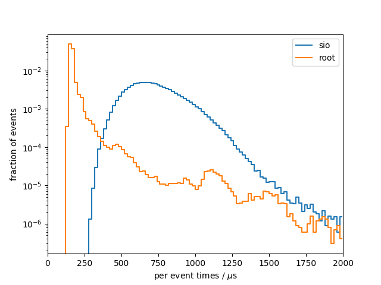
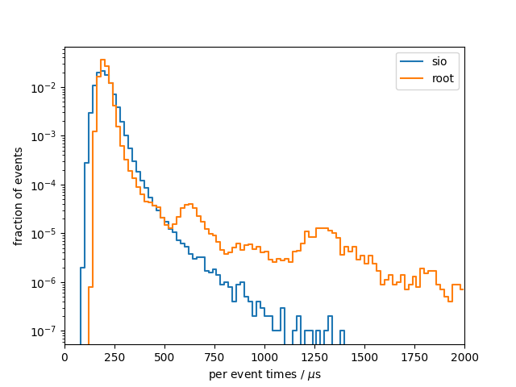

# Benchmark results
## System info
- CPU: `Intel(R) Core(TM) i7-9750H CPU @ 2.60GHz`
- Total available memory: `15992356 kB`

## write

### sio
Results from 10 benchmark runs with 100000 events each
|                          |   min    |   mean   |   max    |
|--------------------------|----------|----------|----------|
| total [s]                |    69.93 |    72.67 |    74.31 |
| total setup [ms]         |    16.80 |    17.61 |    18.47 |
| constructor [ms]         |    2.247 |    2.366 |    2.606 |
| finish [ms]              |    14.45 |    15.24 |    16.21 |
| median [us]              |    678.2 |    704.0 |    718.4 |
| min [us]                 |    284.0 |    294.3 |    303.0 |
| max [us]                 |     2043 |     6123 | 1.13e+04 |
| 90 percentile [us]       |    924.6 |    961.8 |    990.2 |
| 99 percentile [us]       |     1157 |     1218 |     1310 |

### root
Results from 10 benchmark runs with 100000 events each
|                          |   min    |   mean   |   max    |
|--------------------------|----------|----------|----------|
| total [s]                |    32.67 |    34.31 |    35.84 |
| total setup [ms]         |    458.3 |    479.9 |    516.5 |
| constructor [ms]         |    27.90 |    31.69 |    43.11 |
| finish [ms]              |    427.6 |    448.2 |    486.4 |
| median [us]              |    153.6 |    160.0 |    169.9 |
| min [us]                 |    131.0 |    136.6 |    145.1 |
| max [us]                 | 9.23e+05 | 9.71e+05 | 1.02e+06 |
| 90 percentile [us]       |    169.0 |    194.3 |    231.2 |
| 99 percentile [us]       |    446.2 |    547.8 |    695.2 |

### per-event comparison plot

## read

### sio
Results from 10 benchmark runs with 100000 events each
|                          |   min    |   mean   |   max    |
|--------------------------|----------|----------|----------|
| total [s]                |    19.13 |    20.14 |    22.46 |
| total setup [ms]         |    4.924 |    5.164 |    6.125 |
| open file [ms]           |    2.677 |    2.796 |    3.149 |
| constructor [us]         |     2216 |     2357 |     2965 |
| read collection ids [us] |    0.152 |    0.210 |    0.481 |
| close file [us]          |    5.876 |    8.877 |    14.51 |
| median [us]              |    186.0 |    195.3 |    212.4 |
| min [us]                 |    93.70 |    98.98 |    105.3 |
| max [us]                 |    584.3 |     1296 |     4970 |
| 90 percentile [us]       |    239.5 |    253.4 |    292.3 |
| 99 percentile [us]       |    307.1 |    331.2 |    456.5 |

### root
Results from 10 benchmark runs with 100000 events each
|                          |   min    |   mean   |   max    |
|--------------------------|----------|----------|----------|
| total [s]                |    24.22 |    25.51 |    26.84 |
| total setup [ms]         |    197.9 |    207.9 |    232.4 |
| open file [ms]           |    190.8 |    200.7 |    225.0 |
| constructor [us]         |    0.388 |    0.530 |    0.965 |
| read collection ids [us] |    0.401 |    0.456 |    0.598 |
| close file [us]          |     6512 |     7186 |     7505 |
| median [us]              |    186.0 |    197.8 |    210.7 |
| min [us]                 |    133.8 |    144.8 |    156.5 |
| max [us]                 | 3.59e+05 | 3.73e+05 | 3.91e+05 |
| 90 percentile [us]       |    220.9 |    232.9 |    244.2 |
| 99 percentile [us]       |    311.8 |    344.1 |    461.6 |

### per-event comparison plot

