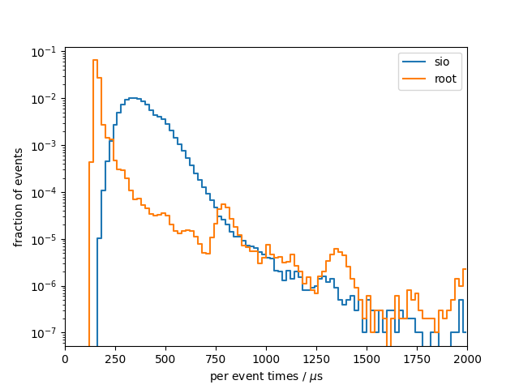
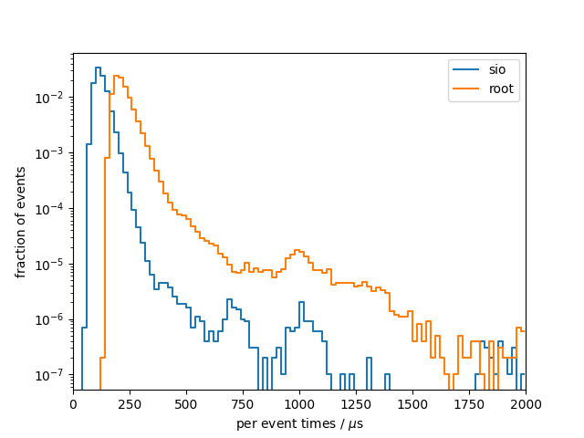

# Benchmark results
## System info
- CPU: `Intel(R) Core(TM) i7-9750H CPU @ 2.60GHz`
- Total available memory: `15991820 kB`
- ROOT version: `6.20/04`
- ROOT features `cxx17 asimage builtin_afterimage builtin_clang builtin_llvm dataframe davix exceptions gdml gsl_shared imt mathmore mlp minuit2 opengl pyroot pythia8 r roofit root7 rpath shared soversion sqlite ssl tmva unuran vc vmc vdt x11 xml xrootd`

## write

### sio
Results from 10 benchmark runs with 100000 events each

#### Wall times
| min [s]  | mean [s] |  max [s] |
|----------|----------|----------|
|    162.1 |    164.7 |    168.9 |

#### I/O times
|                          |   min    |   mean   |   max    |
|--------------------------|----------|----------|----------|
| total [s]                |    37.52 |    38.12 |    38.73 |
#### Setup times
|                          |   min    |   mean   |   max    |
|--------------------------|----------|----------|----------|
| total setup [ms]         |    10.52 |    12.18 |    16.36 |
| constructor [ms]         |    1.921 |    2.877 |    5.116 |
| finish [ms]              |    8.468 |    9.293 |    14.34 |
#### Per event times
|                          |   min    |   mean   |   max    |
|--------------------------|----------|----------|----------|
| median [us]              |    361.6 |    367.1 |    371.9 |
| min [us]                 |    162.8 |    167.9 |    171.2 |
| max [us]                 |     2519 |     3532 |     6149 |
| 90 percentile [us]       |    491.6 |    499.7 |    507.8 |
| 99 percentile [us]       |    627.3 |    638.1 |    670.9 |

### root
Results from 10 benchmark runs with 100000 events each

#### Wall times
| min [s]  | mean [s] |  max [s] |
|----------|----------|----------|
|    154.6 |    156.5 |    158.4 |

#### I/O times
|                          |   min    |   mean   |   max    |
|--------------------------|----------|----------|----------|
| total [s]                |    27.02 |    27.42 |    27.74 |
#### Setup times
|                          |   min    |   mean   |   max    |
|--------------------------|----------|----------|----------|
| total setup [ms]         |    340.4 |    352.3 |    366.8 |
| constructor [ms]         |    28.46 |    30.86 |    40.81 |
| finish [ms]              |    311.5 |    321.5 |    328.4 |
#### Per event times
|                          |   min    |   mean   |   max    |
|--------------------------|----------|----------|----------|
| median [us]              |    153.9 |    156.6 |    159.8 |
| min [us]                 |    129.9 |    134.1 |    135.7 |
| max [us]                 | 7.33e+05 | 7.48e+05 | 7.65e+05 |
| 90 percentile [us]       |    168.8 |    173.9 |    178.1 |
| 99 percentile [us]       |    347.6 |    380.5 |    475.9 |

### per-event comparison plot

## read

### sio
Results from 10 benchmark runs with 100000 events each

#### Wall times
| min [s]  | mean [s] |  max [s] |
|----------|----------|----------|
|    21.69 |    21.84 |    22.25 |

#### I/O times
|                          |   min    |   mean   |   max    |
|--------------------------|----------|----------|----------|
| total [s]                |    12.23 |    12.35 |    12.62 |
#### Setup times
|                          |   min    |   mean   |   max    |
|--------------------------|----------|----------|----------|
| total setup [ms]         |    3.769 |    4.211 |    6.552 |
| close file [us]          |    5.982 |    7.716 |    9.990 |
| constructor [us]         |     1920 |     2062 |     2594 |
| read collection ids [us] |    0.165 |    0.184 |    0.241 |
| open file [ms]           |    1.810 |    2.140 |    4.538 |
#### Per event times
|                          |   min    |   mean   |   max    |
|--------------------------|----------|----------|----------|
| median [us]              |    117.0 |    118.1 |    121.0 |
| min [us]                 |    57.79 |    60.13 |    62.34 |
| max [us]                 |     1120 |     1919 |     2575 |
| 90 percentile [us]       |    157.8 |    159.4 |    162.4 |
| 99 percentile [us]       |    211.9 |    215.5 |    222.0 |

### root
Results from 10 benchmark runs with 100000 events each

#### Wall times
| min [s]  | mean [s] |  max [s] |
|----------|----------|----------|
|    35.24 |    35.81 |    36.68 |

#### I/O times
|                          |   min    |   mean   |   max    |
|--------------------------|----------|----------|----------|
| total [s]                |    25.60 |    26.13 |    26.84 |
#### Setup times
|                          |   min    |   mean   |   max    |
|--------------------------|----------|----------|----------|
| total setup [ms]         |    395.8 |    405.1 |    420.5 |
| close file [us]          |     6660 |     8006 |     9429 |
| constructor [us]         |    0.264 |    0.536 |    1.369 |
| read collection ids [us] |    0.372 |    0.444 |    0.673 |
| open file [ms]           |    387.0 |    397.1 |    413.0 |
#### Per event times
|                          |   min    |   mean   |   max    |
|--------------------------|----------|----------|----------|
| median [us]              |    206.4 |    211.1 |    218.5 |
| min [us]                 |    138.5 |    144.2 |    149.3 |
| max [us]                 | 2.69e+05 | 2.79e+05 | 3.05e+05 |
| 90 percentile [us]       |    273.7 |    279.2 |    285.5 |
| 99 percentile [us]       |    395.6 |    412.4 |    420.4 |

### per-event comparison plot

