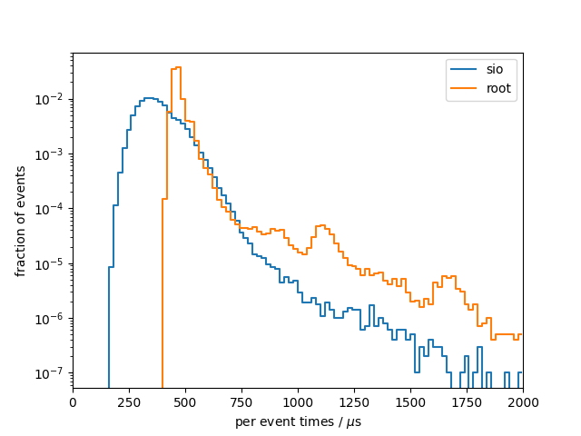
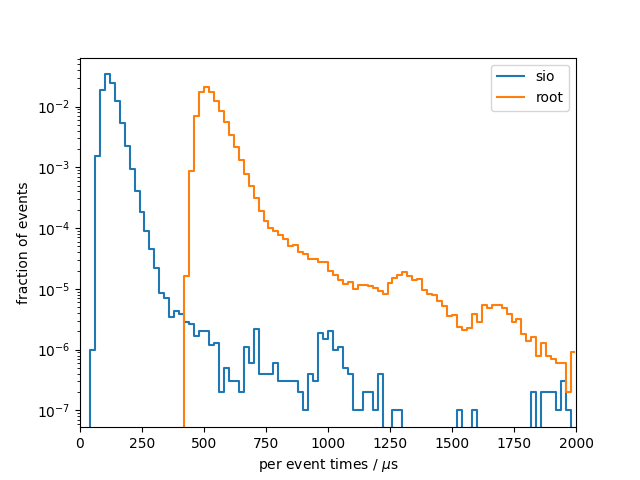

# Benchmark results
## System info
- CPU: `Intel(R) Core(TM) i7-9750H CPU @ 2.60GHz`
- Total available memory: `15991820 kB`
- ROOT version: `6.22/06`
- ROOT features `cxx17 asimage builtin_afterimage builtin_clang builtin_llvm dataframe davix exceptions gdml gsl_shared imt mathmore mlp minuit2 opengl pyroot pythia8 r roofit root7 rpath shared soversion sqlite ssl tmva tmva-rmva unuran vc vmc vdt x11 xml xrootd`

## write

### sio
Results from 10 benchmark runs with 100000 events each

#### Wall times
| min [s]  | mean [s] |  max [s] |
|----------|----------|----------|
|    169.4 |    172.7 |    175.2 |

#### I/O times
|                          |   min    |   mean   |   max    |
|--------------------------|----------|----------|----------|
| total [s]                |    37.38 |    38.10 |    38.56 |
#### Setup times
|                          |   min    |   mean   |   max    |
|--------------------------|----------|----------|----------|
| total setup [ms]         |    10.36 |    11.04 |    14.83 |
| constructor [ms]         |    1.921 |    2.425 |    5.887 |
| finish [ms]              |    8.368 |    8.601 |    8.924 |
#### Per event times
|                          |   min    |   mean   |   max    |
|--------------------------|----------|----------|----------|
| median [us]              |    360.5 |    367.1 |    371.3 |
| min [us]                 |    163.2 |    167.2 |    170.8 |
| max [us]                 |     2774 |     8264 | 2.27e+04 |
| 90 percentile [us]       |    490.0 |    499.5 |    505.6 |
| 99 percentile [us]       |    622.9 |    634.2 |    643.6 |

### root
Results from 10 benchmark runs with 100000 events each

#### Wall times
| min [s]  | mean [s] |  max [s] |
|----------|----------|----------|
|    193.6 |    196.0 |    197.8 |

#### I/O times
|                          |   min    |   mean   |   max    |
|--------------------------|----------|----------|----------|
| total [s]                |    57.29 |    58.52 |    59.84 |
#### Setup times
|                          |   min    |   mean   |   max    |
|--------------------------|----------|----------|----------|
| total setup [ms]         |    264.1 |    272.9 |    292.0 |
| constructor [ms]         |    24.07 |    26.51 |    34.36 |
| finish [ms]              |    238.4 |    246.4 |    259.6 |
#### Per event times
|                          |   min    |   mean   |   max    |
|--------------------------|----------|----------|----------|
| median [us]              |    451.6 |    463.5 |    478.1 |
| min [us]                 |    405.6 |    422.2 |    429.9 |
| max [us]                 | 7.19e+05 | 7.38e+05 | 7.56e+05 |
| 90 percentile [us]       |    500.6 |    515.4 |    528.2 |
| 99 percentile [us]       |    774.3 |    830.3 |    904.9 |

### per-event comparison plot

## read

### sio
Results from 10 benchmark runs with 100000 events each

#### Wall times
| min [s]  | mean [s] |  max [s] |
|----------|----------|----------|
|    21.20 |    21.74 |    22.12 |

#### I/O times
|                          |   min    |   mean   |   max    |
|--------------------------|----------|----------|----------|
| total [s]                |    12.01 |    12.28 |    12.51 |
#### Setup times
|                          |   min    |   mean   |   max    |
|--------------------------|----------|----------|----------|
| total setup [ms]         |    3.740 |    3.871 |    3.954 |
| close file [us]          |    6.221 |    7.460 |    8.639 |
| read collection ids [us] |    0.157 |    0.210 |    0.478 |
| constructor [us]         |     1910 |     2003 |     2088 |
| open file [ms]           |    1.820 |    1.859 |    1.901 |
#### Per event times
|                          |   min    |   mean   |   max    |
|--------------------------|----------|----------|----------|
| median [us]              |    115.1 |    117.5 |    119.3 |
| min [us]                 |    58.43 |    59.53 |    60.31 |
| max [us]                 |     1086 |     2126 |     4332 |
| 90 percentile [us]       |    154.6 |    158.6 |    162.1 |
| 99 percentile [us]       |    209.1 |    214.4 |    223.7 |

### root
Results from 10 benchmark runs with 100000 events each

#### Wall times
| min [s]  | mean [s] |  max [s] |
|----------|----------|----------|
|    66.50 |    67.43 |    68.73 |

#### I/O times
|                          |   min    |   mean   |   max    |
|--------------------------|----------|----------|----------|
| total [s]                |    56.61 |    57.55 |    58.63 |
#### Setup times
|                          |   min    |   mean   |   max    |
|--------------------------|----------|----------|----------|
| total setup [ms]         |    419.4 |    429.6 |    459.2 |
| close file [us]          |     6619 |     7607 |     8408 |
| read collection ids [us] |    0.346 |    0.391 |    0.437 |
| constructor [us]         |    0.308 |    0.412 |    0.987 |
| open file [ms]           |    411.4 |    421.9 |    450.8 |
#### Per event times
|                          |   min    |   mean   |   max    |
|--------------------------|----------|----------|----------|
| median [us]              |    513.8 |    523.3 |    534.0 |
| min [us]                 |    424.9 |    436.7 |    449.6 |
| max [us]                 | 2.80e+05 | 2.85e+05 | 2.93e+05 |
| 90 percentile [us]       |    590.5 |    598.9 |    607.5 |
| 99 percentile [us]       |    743.2 |    769.0 |    825.9 |

### per-event comparison plot

