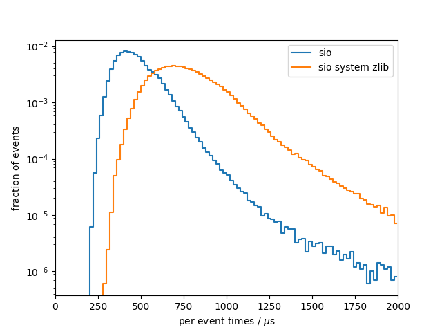
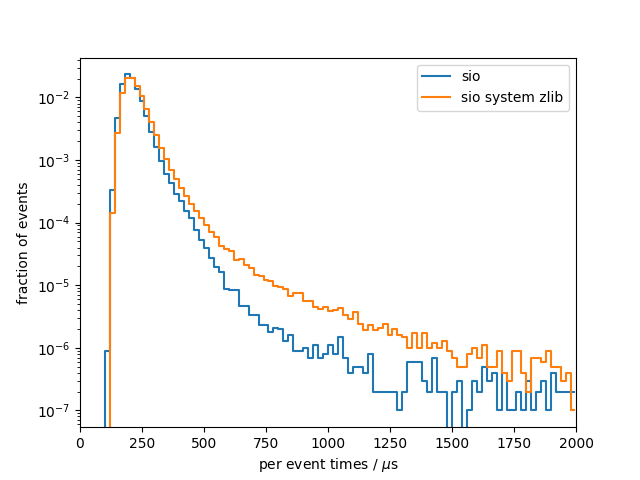

# Benchmark results
## System info
- CPU: `Intel(R) Core(TM) i7-9750H CPU @ 2.60GHz`
- Total available memory: `15991820 kB`

## write

### sio
Results from 10 benchmark runs with 100000 events each
|                          |   min    |   mean   |   max    |
|--------------------------|----------|----------|----------|
| total [s]                |    45.75 |    47.63 |    52.41 |
#### Setup times
|                          |   min    |   mean   |   max    |
|--------------------------|----------|----------|----------|
| total setup [ms]         |    11.07 |    12.39 |    15.62 |
| constructor [ms]         |    2.358 |    3.365 |    5.937 |
| finish [ms]              |    8.685 |    8.998 |    9.635 |
#### Per event times
|                          |   min    |   mean   |   max    |
|--------------------------|----------|----------|----------|
| median [us]              |    441.4 |    455.0 |    492.3 |
| min [us]                 |    201.1 |    204.7 |    213.4 |
| max [us]                 |     2701 |     3833 |     5416 |
| 90 percentile [us]       |    598.3 |    629.5 |    710.9 |
| 99 percentile [us]       |    763.2 |    858.1 |     1058 |

### sio system zlib
Results from 10 benchmark runs with 100000 events each
|                          |   min    |   mean   |   max    |
|--------------------------|----------|----------|----------|
| total [s]                |    73.99 |    77.75 |    81.67 |
#### Setup times
|                          |   min    |   mean   |   max    |
|--------------------------|----------|----------|----------|
| total setup [ms]         |    17.75 |    18.88 |    21.54 |
| constructor [ms]         |    2.408 |    3.258 |    6.044 |
| finish [ms]              |    15.19 |    15.60 |    16.44 |
#### Per event times
|                          |   min    |   mean   |   max    |
|--------------------------|----------|----------|----------|
| median [us]              |    718.0 |    745.5 |    779.3 |
| min [us]                 |    285.5 |    300.8 |    317.7 |
| max [us]                 |     4222 |     5218 |     6509 |
| 90 percentile [us]       |    971.4 |     1034 |     1098 |
| 99 percentile [us]       |     1241 |     1459 |     1582 |

### per-event comparison plot

## read

### sio
Results from 10 benchmark runs with 100000 events each
|                          |   min    |   mean   |   max    |
|--------------------------|----------|----------|----------|
| total [s]                |    20.38 |    21.41 |    23.10 |
#### Setup times
|                          |   min    |   mean   |   max    |
|--------------------------|----------|----------|----------|
| total setup [ms]         |    4.060 |    4.371 |    4.491 |
| open file [ms]           |    1.778 |    1.874 |    1.955 |
| read collection ids [us] |    0.163 |    0.498 |    3.100 |
| constructor [us]         |     2272 |     2485 |     2620 |
| close file [us]          |    7.739 |    10.52 |    24.99 |
#### Per event times
|                          |   min    |   mean   |   max    |
|--------------------------|----------|----------|----------|
| median [us]              |    196.6 |    204.7 |    218.5 |
| min [us]                 |    116.9 |    120.5 |    126.3 |
| max [us]                 |    942.8 |     2007 |     2773 |
| 90 percentile [us]       |    253.1 |    268.0 |    296.3 |
| 99 percentile [us]       |    330.0 |    377.3 |    447.1 |

### sio system zlib
Results from 10 benchmark runs with 100000 events each
|                          |   min    |   mean   |   max    |
|--------------------------|----------|----------|----------|
| total [s]                |    21.44 |    22.75 |    24.44 |
#### Setup times
|                          |   min    |   mean   |   max    |
|--------------------------|----------|----------|----------|
| total setup [ms]         |    4.436 |    4.724 |    5.402 |
| open file [ms]           |    2.059 |    2.156 |    2.423 |
| read collection ids [us] |    0.163 |    0.296 |    0.971 |
| constructor [us]         |     2359 |     2558 |     2966 |
| close file [us]          |    7.575 |    8.387 |    9.573 |
#### Per event times
|                          |   min    |   mean   |   max    |
|--------------------------|----------|----------|----------|
| median [us]              |    206.1 |    214.5 |    225.7 |
| min [us]                 |    120.4 |    125.5 |    131.1 |
| max [us]                 |     1911 |     2614 |     3167 |
| 90 percentile [us]       |    267.3 |    289.0 |    318.4 |
| 99 percentile [us]       |    357.0 |    443.0 |    540.1 |

### per-event comparison plot

