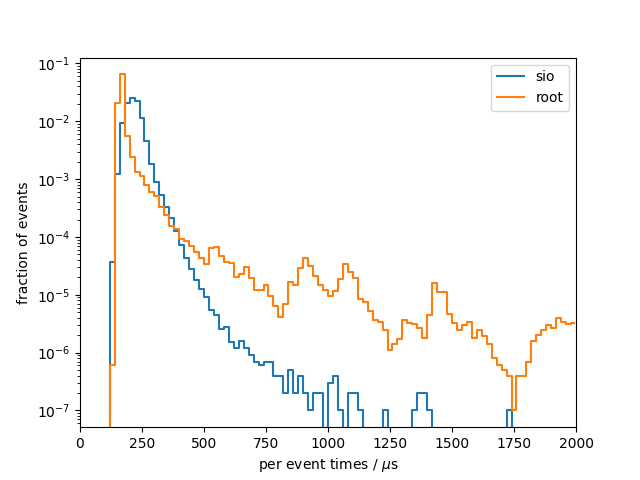
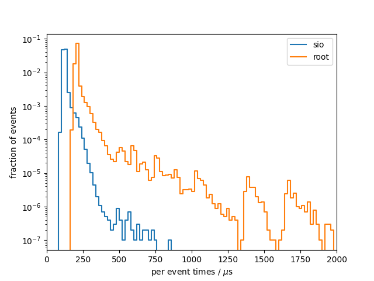

# Benchmark results
## System info
- CPU: `Intel(R) Core(TM) i7-9750H CPU @ 2.60GHz`
- Total available memory: `15992388 kB`

## write

### sio
Results from 10 benchmark runs with 100000 events each
|                          |   min    |   mean   |   max    |
|--------------------------|----------|----------|----------|
| total [s]                |    21.71 |    21.78 |    21.83 |
#### Setup times
|                          |   min    |   mean   |   max    |
|--------------------------|----------|----------|----------|
| total setup [ms]         |    22.81 |    24.00 |    27.81 |
| constructor [ms]         |    2.312 |    3.131 |    6.370 |
| finish [ms]              |    20.38 |    20.84 |    21.74 |
#### Per event times
|                          |   min    |   mean   |   max    |
|--------------------------|----------|----------|----------|
| median [us]              |    213.6 |    214.2 |    214.7 |
| min [us]                 |    126.2 |    127.3 |    128.9 |
| max [us]                 |    893.9 |     1317 |     2187 |
| 90 percentile [us]       |    255.8 |    256.6 |    257.4 |
| 99 percentile [us]       |    332.9 |    334.9 |    336.7 |

### root
Results from 10 benchmark runs with 100000 events each
|                          |   min    |   mean   |   max    |
|--------------------------|----------|----------|----------|
| total [s]                |    20.49 |    21.19 |    21.94 |
#### Setup times
|                          |   min    |   mean   |   max    |
|--------------------------|----------|----------|----------|
| total setup [ms]         |    524.7 |    529.7 |    536.1 |
| constructor [ms]         |    28.14 |    29.76 |    38.06 |
| finish [ms]              |    492.4 |    500.0 |    507.3 |
#### Per event times
|                          |   min    |   mean   |   max    |
|--------------------------|----------|----------|----------|
| median [us]              |    159.4 |    165.4 |    168.7 |
| min [us]                 |    137.6 |    142.8 |    146.2 |
| max [us]                 | 9.97e+05 | 1.01e+06 | 1.05e+06 |
| 90 percentile [us]       |    185.3 |    194.9 |    210.7 |
| 99 percentile [us]       |    525.3 |    542.1 |    606.3 |

### per-event comparison plot

## read

### sio
Results from 10 benchmark runs with 100000 events each
|                          |   min    |   mean   |   max    |
|--------------------------|----------|----------|----------|
| total [s]                |    12.14 |    12.25 |    12.34 |
#### Setup times
|                          |   min    |   mean   |   max    |
|--------------------------|----------|----------|----------|
| total setup [ms]         |    5.514 |    6.419 |    10.74 |
| read collection ids [us] |    0.165 |    0.230 |    0.563 |
| open file [ms]           |    3.164 |    3.497 |    4.608 |
| constructor [us]         |     2307 |     2910 |     6182 |
| close file [us]          |    6.962 |    9.490 |    22.14 |
#### Per event times
|                          |   min    |   mean   |   max    |
|--------------------------|----------|----------|----------|
| median [us]              |    120.4 |    121.4 |    122.3 |
| min [us]                 |    87.12 |    88.55 |    90.30 |
| max [us]                 |    553.0 |    643.0 |    856.1 |
| 90 percentile [us]       |    132.5 |    133.9 |    135.1 |
| 99 percentile [us]       |    189.0 |    195.5 |    201.6 |

### root
Results from 10 benchmark runs with 100000 events each
|                          |   min    |   mean   |   max    |
|--------------------------|----------|----------|----------|
| total [s]                |    22.06 |    22.43 |    22.89 |
#### Setup times
|                          |   min    |   mean   |   max    |
|--------------------------|----------|----------|----------|
| total setup [ms]         |    198.8 |    202.8 |    206.7 |
| read collection ids [us] |    0.370 |    0.444 |    0.592 |
| open file [ms]           |    192.2 |    196.0 |    199.7 |
| constructor [us]         |    0.371 |    0.487 |    0.749 |
| close file [us]          |     6584 |     6841 |     7216 |
#### Per event times
|                          |   min    |   mean   |   max    |
|--------------------------|----------|----------|----------|
| median [us]              |    203.2 |    206.5 |    210.9 |
| min [us]                 |    163.2 |    166.4 |    171.2 |
| max [us]                 | 3.51e+05 | 3.55e+05 | 3.62e+05 |
| 90 percentile [us]       |    214.1 |    219.3 |    225.7 |
| 99 percentile [us]       |    347.3 |    359.9 |    369.9 |

### per-event comparison plot

