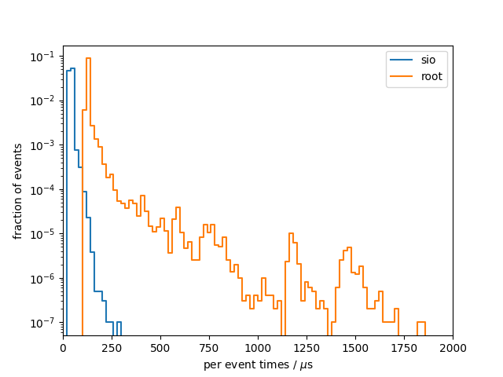

# Benchmark results
## System info
- CPU: `Intel(R) Core(TM) i7-9750H CPU @ 2.60GHz`
- Total available memory: `15991820 kB`
- ROOT version: `6.20/04`
- ROOT features `cxx17 asimage builtin_afterimage builtin_clang builtin_llvm dataframe davix exceptions gdml gsl_shared imt mathmore mlp minuit2 opengl pyroot pythia8 r roofit root7 rpath shared soversion sqlite ssl tmva unuran vc vmc vdt x11 xml xrootd`

## write

### sio
Results from 10 benchmark runs with 100000 events each

#### Wall times
| min [s]  | mean [s] |  max [s] |
|----------|----------|----------|
|     1263 |     1266 |     1270 |

#### I/O times
|                          |   min    |   mean   |   max    |
|--------------------------|----------|----------|----------|
| total [s]                |    12.22 |    12.27 |    12.34 |
#### Setup times
|                          |   min    |   mean   |   max    |
|--------------------------|----------|----------|----------|
| total setup [ms]         |    10.31 |    10.92 |    13.40 |
| constructor [ms]         |    1.950 |    2.312 |    4.836 |
| finish [ms]              |    8.345 |    8.593 |    9.048 |
#### Per event times
|                          |   min    |   mean   |   max    |
|--------------------------|----------|----------|----------|
| median [us]              |    120.8 |    121.1 |    121.6 |
| min [us]                 |    73.32 |    74.40 |    75.59 |
| max [us]                 |    445.3 |    909.0 |     1266 |
| 90 percentile [us]       |    140.2 |    140.8 |    141.8 |
| 99 percentile [us]       |    176.5 |    182.1 |    191.2 |

### root
Results from 10 benchmark runs with 100000 events each

#### Wall times
| min [s]  | mean [s] |  max [s] |
|----------|----------|----------|
|     1270 |     1273 |     1279 |

#### I/O times
|                          |   min    |   mean   |   max    |
|--------------------------|----------|----------|----------|
| total [s]                |    17.76 |    18.28 |    18.71 |
#### Setup times
|                          |   min    |   mean   |   max    |
|--------------------------|----------|----------|----------|
| total setup [ms]         |    662.9 |    670.6 |    690.5 |
| constructor [ms]         |    29.07 |    31.12 |    42.31 |
| finish [ms]              |    632.3 |    639.5 |    660.9 |
#### Per event times
|                          |   min    |   mean   |   max    |
|--------------------------|----------|----------|----------|
| median [us]              |    138.3 |    143.1 |    145.5 |
| min [us]                 |    124.2 |    128.8 |    133.0 |
| max [us]                 | 7.59e+05 | 7.74e+05 | 7.92e+05 |
| 90 percentile [us]       |    153.2 |    160.6 |    171.4 |
| 99 percentile [us]       |    373.3 |    393.8 |    442.7 |

### per-event comparison plot

## read

### sio
Results from 10 benchmark runs with 100000 events each

#### Wall times
| min [s]  | mean [s] |  max [s] |
|----------|----------|----------|
|    5.781 |    5.943 |    6.143 |

#### I/O times
|                          |   min    |   mean   |   max    |
|--------------------------|----------|----------|----------|
| total [s]                |    3.921 |    4.011 |    4.120 |
#### Setup times
|                          |   min    |   mean   |   max    |
|--------------------------|----------|----------|----------|
| total setup [ms]         |    3.987 |    4.587 |    8.940 |
| open file [ms]           |    2.043 |    2.217 |    3.319 |
| read collection ids [us] |    0.101 |    0.130 |    0.180 |
| constructor [us]         |     1934 |     2360 |     5613 |
| close file [us]          |    6.354 |    7.715 |    8.553 |
#### Per event times
|                          |   min    |   mean   |   max    |
|--------------------------|----------|----------|----------|
| median [us]              |    39.84 |    40.50 |    41.24 |
| min [us]                 |    25.38 |    26.12 |    26.78 |
| max [us]                 |    138.8 |    177.6 |    290.5 |
| 90 percentile [us]       |    44.68 |    45.60 |    47.19 |
| 99 percentile [us]       |    52.46 |    63.10 |    73.43 |

### root
Results from 10 benchmark runs with 100000 events each

#### Wall times
| min [s]  | mean [s] |  max [s] |
|----------|----------|----------|
|    15.86 |    16.34 |    16.83 |

#### I/O times
|                          |   min    |   mean   |   max    |
|--------------------------|----------|----------|----------|
| total [s]                |    13.85 |    14.31 |    14.77 |
#### Setup times
|                          |   min    |   mean   |   max    |
|--------------------------|----------|----------|----------|
| total setup [ms]         |    398.4 |    406.9 |    417.7 |
| open file [ms]           |    390.4 |    399.6 |    410.6 |
| read collection ids [us] |    0.156 |    0.175 |    0.214 |
| constructor [us]         | 4.40e-02 | 7.95e-02 |    0.219 |
| close file [us]          |     6255 |     7306 |     8135 |
#### Per event times
|                          |   min    |   mean   |   max    |
|--------------------------|----------|----------|----------|
| median [us]              |    121.4 |    127.3 |    131.9 |
| min [us]                 |    107.2 |    111.8 |    115.2 |
| max [us]                 | 2.54e+05 | 2.57e+05 | 2.66e+05 |
| 90 percentile [us]       |    130.1 |    134.7 |    138.8 |
| 99 percentile [us]       |    212.5 |    233.7 |    254.8 |

### per-event comparison plot

