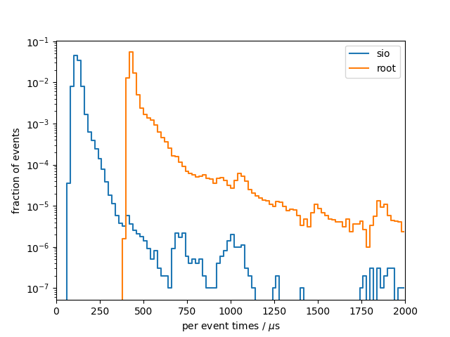
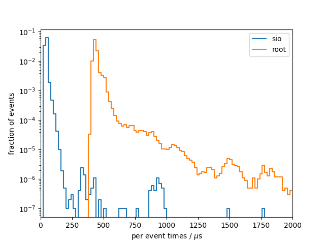

# Benchmark results
## System info
- CPU: `Intel(R) Core(TM) i7-9750H CPU @ 2.60GHz`
- Total available memory: `15991820 kB`
- ROOT version: `6.22/06`
- ROOT features `cxx17 asimage builtin_afterimage builtin_clang builtin_llvm dataframe davix exceptions gdml gsl_shared imt mathmore mlp minuit2 opengl pyroot pythia8 r roofit root7 rpath shared soversion sqlite ssl tmva tmva-rmva unuran vc vmc vdt x11 xml xrootd`

## write

### sio
Results from 10 benchmark runs with 100000 events each

#### Wall times
| min [s]  | mean [s] |  max [s] |
|----------|----------|----------|
|     1261 |     1271 |     1300 |

#### I/O times
|                          |   min    |   mean   |   max    |
|--------------------------|----------|----------|----------|
| total [s]                |    12.03 |    12.16 |    12.48 |
#### Setup times
|                          |   min    |   mean   |   max    |
|--------------------------|----------|----------|----------|
| total setup [ms]         |    9.999 |    10.71 |    13.14 |
| constructor [ms]         |    1.929 |    2.293 |    4.792 |
| finish [ms]              |    8.052 |    8.402 |    9.266 |
#### Per event times
|                          |   min    |   mean   |   max    |
|--------------------------|----------|----------|----------|
| median [us]              |    117.5 |    118.5 |    120.9 |
| min [us]                 |    70.15 |    71.45 |    72.62 |
| max [us]                 |     1105 | 1.31e+04 | 2.84e+04 |
| 90 percentile [us]       |    139.5 |    141.6 |    147.4 |
| 99 percentile [us]       |    193.7 |    198.4 |    201.0 |

### root
Results from 10 benchmark runs with 100000 events each

#### Wall times
| min [s]  | mean [s] |  max [s] |
|----------|----------|----------|
|     1298 |     1301 |     1303 |

#### I/O times
|                          |   min    |   mean   |   max    |
|--------------------------|----------|----------|----------|
| total [s]                |    47.42 |    48.00 |    48.58 |
#### Setup times
|                          |   min    |   mean   |   max    |
|--------------------------|----------|----------|----------|
| total setup [ms]         |    574.2 |    592.6 |    612.5 |
| constructor [ms]         |    23.76 |    28.16 |    37.41 |
| finish [ms]              |    549.3 |    564.5 |    576.7 |
#### Per event times
|                          |   min    |   mean   |   max    |
|--------------------------|----------|----------|----------|
| median [us]              |    425.1 |    431.4 |    436.6 |
| min [us]                 |    397.4 |    405.5 |    412.9 |
| max [us]                 | 7.52e+05 | 7.72e+05 | 7.86e+05 |
| 90 percentile [us]       |    480.5 |    488.8 |    498.2 |
| 99 percentile [us]       |    827.2 |    867.4 |    909.2 |

### per-event comparison plot

## read

### sio
Results from 10 benchmark runs with 100000 events each

#### Wall times
| min [s]  | mean [s] |  max [s] |
|----------|----------|----------|
|    6.776 |    7.022 |    7.813 |

#### I/O times
|                          |   min    |   mean   |   max    |
|--------------------------|----------|----------|----------|
| total [s]                |    4.156 |    4.297 |    4.778 |
#### Setup times
|                          |   min    |   mean   |   max    |
|--------------------------|----------|----------|----------|
| total setup [ms]         |    3.979 |    4.228 |    5.038 |
| constructor [us]         |     1922 |     2074 |     2579 |
| read collection ids [us] |    0.155 |    0.223 |    0.328 |
| open file [ms]           |    2.022 |    2.144 |    2.451 |
| close file [us]          |    6.278 |    7.806 |    8.214 |
#### Per event times
|                          |   min    |   mean   |   max    |
|--------------------------|----------|----------|----------|
| median [us]              |    41.75 |    42.88 |    46.73 |
| min [us]                 |    27.01 |    27.89 |    28.94 |
| max [us]                 |    932.8 |     1357 |     4405 |
| 90 percentile [us]       |    47.03 |    48.89 |    57.28 |
| 99 percentile [us]       |    70.59 |    74.22 |    78.13 |

### root
Results from 10 benchmark runs with 100000 events each

#### Wall times
| min [s]  | mean [s] |  max [s] |
|----------|----------|----------|
|    47.51 |    48.70 |    49.65 |

#### I/O times
|                          |   min    |   mean   |   max    |
|--------------------------|----------|----------|----------|
| total [s]                |    44.57 |    45.64 |    46.58 |
#### Setup times
|                          |   min    |   mean   |   max    |
|--------------------------|----------|----------|----------|
| total setup [ms]         |    414.9 |    427.2 |    448.5 |
| constructor [us]         |    0.310 |    0.383 |    0.576 |
| read collection ids [us] |    0.345 |    0.449 |    0.576 |
| open file [ms]           |    408.5 |    420.5 |    441.1 |
| close file [us]          |     6110 |     6642 |     7486 |
#### Per event times
|                          |   min    |   mean   |   max    |
|--------------------------|----------|----------|----------|
| median [us]              |    423.2 |    434.5 |    442.8 |
| min [us]                 |    386.0 |    396.5 |    405.6 |
| max [us]                 | 2.55e+05 | 2.59e+05 | 2.66e+05 |
| 90 percentile [us]       |    457.9 |    474.1 |    485.9 |
| 99 percentile [us]       |    584.0 |    621.5 |    670.1 |

### per-event comparison plot

