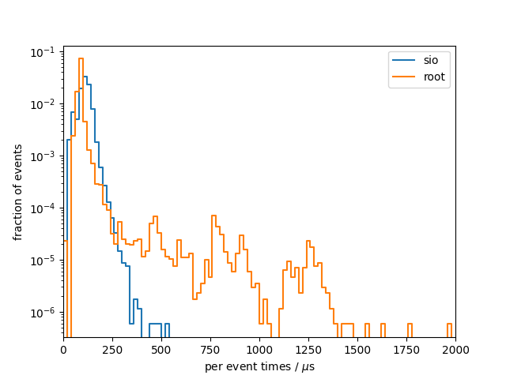

# Benchmark results
## System info
- CPU: `Intel(R) Core(TM) i7-9750H CPU @ 2.60GHz`
- Total available memory: `15991820 kB`

## read

### sio
Results from 10 benchmark runs with 17143 events each

#### I/O times
|                          |   min    |   mean   |   max    |
|--------------------------|----------|----------|----------|
| total [s]                |    1.828 |    1.859 |    1.882 |
#### Setup times
|                          |   min    |   mean   |   max    |
|--------------------------|----------|----------|----------|
| total setup [ms]         |    2.167 |    3.108 |    6.039 |
| close file [us]          | 0.00e+00 | 0.00e+00 | 0.00e+00 |
| read collection ids [us] |    0.207 |    0.293 |    0.431 |
| open file [ms]           |    0.391 |    1.125 |    1.469 |
| constructor [us]         |     1599 |     1981 |     4567 |
#### Per event times
|                          |   min    |   mean   |   max    |
|--------------------------|----------|----------|----------|
| median [us]              |    109.0 |    110.3 |    111.2 |
| min [us]                 |    29.01 |    29.80 |    30.76 |
| max [us]                 |    281.9 |    358.1 |    531.3 |
| 90 percentile [us]       |    138.6 |    141.1 |    143.8 |
| 99 percentile [us]       |    174.4 |    182.4 |    190.5 |

### root
Results from 10 benchmark runs with 17143 events each

#### I/O times
|                          |   min    |   mean   |   max    |
|--------------------------|----------|----------|----------|
| total [s]                |    1.817 |    1.876 |    1.962 |
#### Setup times
|                          |   min    |   mean   |   max    |
|--------------------------|----------|----------|----------|
| total setup [ms]         |    60.25 |    64.07 |    71.71 |
| close file [us]          | 0.00e+00 | 0.00e+00 | 0.00e+00 |
| read collection ids [us] |    0.361 |    0.475 |    0.712 |
| open file [ms]           |    60.24 |    64.07 |    71.71 |
| constructor [us]         |    0.349 |    0.705 |    1.240 |
#### Per event times
|                          |   min    |   mean   |   max    |
|--------------------------|----------|----------|----------|
| median [us]              |    82.21 |    84.18 |    87.62 |
| min [us]                 |    7.412 |    7.705 |    7.989 |
| max [us]                 | 1.12e+05 | 1.15e+05 | 1.20e+05 |
| 90 percentile [us]       |    89.00 |    93.72 |    100.5 |
| 99 percentile [us]       |    194.7 |    216.4 |    284.9 |

### per-event comparison plot

