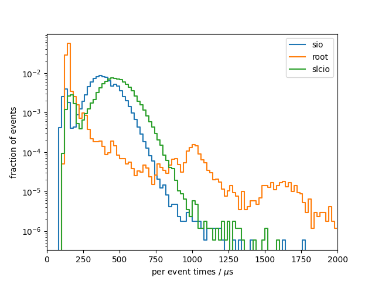

# Benchmark results
## System info
- CPU: `Intel(R) Core(TM) i7-9750H CPU @ 2.60GHz`
- Total available memory: `15991792 kB`
- ROOT version: `6.20/04`
- ROOT features `cxx17 asimage builtin_afterimage builtin_clang builtin_llvm dataframe davix exceptions gdml gsl_shared imt mathmore mlp minuit2 opengl pyroot pythia8 r roofit root7 rpath shared soversion sqlite ssl tmva unuran vc vmc vdt x11 xml xrootd`

## write

### sio
Results from 10 benchmark runs with 17143 events each

#### Wall times
| min [s]  | mean [s] |  max [s] |
|----------|----------|----------|
|    19.80 |    20.32 |    20.84 |

#### I/O times
|                          |   min    |   mean   |   max    |
|--------------------------|----------|----------|----------|
| total [s]                |    6.265 |    6.410 |    6.555 |
#### Setup times
|                          |   min    |   mean   |   max    |
|--------------------------|----------|----------|----------|
| total setup [ms]         |    3.233 |    3.663 |    6.630 |
| constructor [ms]         |    1.945 |    2.299 |    5.202 |
| finish [ms]              |    1.278 |    1.352 |    1.416 |
| register for write [us]  |    9.647 |    11.14 |    20.38 |
#### Per event times
|                          |   min    |   mean   |   max    |
|--------------------------|----------|----------|----------|
| median [us]              |    370.3 |    378.6 |    386.7 |
| min [us]                 |    80.93 |    82.72 |    84.18 |
| max [us]                 |    866.5 |     1226 |     1763 |
| 90 percentile [us]       |    500.9 |    512.4 |    524.5 |
| 99 percentile [us]       |    616.0 |    631.6 |    646.4 |

### root
Results from 10 benchmark runs with 17143 events each

#### Wall times
| min [s]  | mean [s] |  max [s] |
|----------|----------|----------|
|    19.60 |    20.17 |    20.75 |

#### I/O times
|                          |   min    |   mean   |   max    |
|--------------------------|----------|----------|----------|
| total [s]                |    5.841 |    6.019 |    6.251 |
#### Setup times
|                          |   min    |   mean   |   max    |
|--------------------------|----------|----------|----------|
| total setup [ms]         |    895.1 |    917.5 |    954.3 |
| constructor [ms]         |    28.37 |    30.56 |    39.58 |
| finish [ms]              |    866.1 |    887.0 |    922.3 |
| register for write [us]  |    2.955 |    3.206 |    3.595 |
#### Per event times
|                          |   min    |   mean   |   max    |
|--------------------------|----------|----------|----------|
| median [us]              |    140.0 |    144.3 |    148.4 |
| min [us]                 |    115.9 |    119.1 |    121.9 |
| max [us]                 | 9.61e+05 | 1.00e+06 | 1.09e+06 |
| 90 percentile [us]       |    180.4 |    194.2 |    231.9 |
| 99 percentile [us]       |     2346 |     2398 |     2486 |

### slcio
Results from 10 benchmark runs with 17143 events each

#### Wall times
| min [s]  | mean [s] |  max [s] |
|----------|----------|----------|
|    21.28 |    21.63 |    22.36 |

#### I/O times
|                          |   min    |   mean   |   max    |
|--------------------------|----------|----------|----------|
| total [s]                |    7.574 |    7.713 |    7.973 |
#### Setup times
|                          |   min    |   mean   |   max    |
|--------------------------|----------|----------|----------|
| total setup [ms]         |    1.036 |    1.240 |    2.802 |
| constructor [us]         |    980.2 |     1176 |     2719 |
| open file [us]           |    19.53 |    31.69 |    55.05 |
| close [us]               |    29.10 |    32.30 |    49.09 |
#### Per event times
|                          |   min    |   mean   |   max    |
|--------------------------|----------|----------|----------|
| median [us]              |    452.8 |    461.0 |    476.2 |
| min [us]                 |    110.1 |    113.1 |    117.0 |
| max [us]                 |    949.7 |     1291 |     1582 |
| 90 percentile [us]       |    588.8 |    599.8 |    620.3 |
| 99 percentile [us]       |    721.7 |    736.7 |    755.2 |

### per-event comparison plot

## read

### sio
Results from 10 benchmark runs with 17143 events each

#### Wall times
| min [s]  | mean [s] |  max [s] |
|----------|----------|----------|
|    2.788 |    2.841 |    2.935 |

#### I/O times
|                          |   min    |   mean   |   max    |
|--------------------------|----------|----------|----------|
| total [s]                |    1.802 |    1.838 |    1.890 |
#### Setup times
|                          |   min    |   mean   |   max    |
|--------------------------|----------|----------|----------|
| total setup [ms]         |    2.224 |    2.683 |    5.698 |
| constructor [ms]         |    1.838 |    2.263 |    5.084 |
| open file [us]           |    377.3 |    411.9 |    604.6 |
| close file [us]          |    6.353 |    6.876 |    8.269 |
| read collection ids [ns] |    98.00 |    135.2 |    405.0 |
| get entries [us]         |    1.031 |    1.248 |    1.926 |
#### Per event times
|                          |   min    |   mean   |   max    |
|--------------------------|----------|----------|----------|
| median [us]              |    107.3 |    109.3 |    112.6 |
| min [us]                 |    29.23 |    30.38 |    31.99 |
| max [us]                 |    271.1 |    391.4 |    830.7 |
| 90 percentile [us]       |    134.3 |    136.9 |    140.9 |
| 99 percentile [us]       |    167.7 |    176.7 |    198.3 |

### root
Results from 10 benchmark runs with 17143 events each

#### Wall times
| min [s]  | mean [s] |  max [s] |
|----------|----------|----------|
|    5.284 |    5.494 |    5.674 |

#### I/O times
|                          |   min    |   mean   |   max    |
|--------------------------|----------|----------|----------|
| total [s]                |    4.291 |    4.467 |    4.617 |
#### Setup times
|                          |   min    |   mean   |   max    |
|--------------------------|----------|----------|----------|
| total setup [ms]         |    390.5 |    400.5 |    413.7 |
| constructor [ns]         |    44.00 |    68.50 |    178.0 |
| open file [ms]           |    383.5 |    393.0 |    404.9 |
| close file [ms]          |    6.973 |    7.569 |    8.874 |
| read collection ids [ns] |    144.0 |    188.0 |    398.0 |
| get entries [ns]         |    246.0 |    342.6 |    685.0 |
#### Per event times
|                          |   min    |   mean   |   max    |
|--------------------------|----------|----------|----------|
| median [us]              |    175.9 |    185.6 |    192.3 |
| min [us]                 |    110.5 |    119.1 |    127.1 |
| max [us]                 | 3.34e+05 | 3.43e+05 | 3.61e+05 |
| 90 percentile [us]       |    213.8 |    224.2 |    233.5 |
| 99 percentile [us]       |    839.3 |    857.5 |    886.7 |

### slcio
Results from 10 benchmark runs with 17143 events each

#### Wall times
| min [s]  | mean [s] |  max [s] |
|----------|----------|----------|
|    4.074 |    4.159 |    4.281 |

#### I/O times
|                          |   min    |   mean   |   max    |
|--------------------------|----------|----------|----------|
| total [s]                |    3.916 |    4.005 |    4.129 |
#### Setup times
|                          |   min    |   mean   |   max    |
|--------------------------|----------|----------|----------|
| total setup [ms]         |    1.154 |    1.186 |    1.207 |
| constructor [us]         |    962.8 |    988.9 |     1008 |
| open file [us]           |    12.17 |    13.76 |    19.57 |
| get entries [us]         |    65.62 |    69.72 |    77.30 |
| close file [us]          |    2.278 |    2.657 |    2.920 |
| destructor [us]          |    107.3 |    111.4 |    116.4 |
#### Per event times
|                          |   min    |   mean   |   max    |
|--------------------------|----------|----------|----------|
| median [us]              |    234.0 |    239.1 |    246.9 |
| min [us]                 |    50.88 |    52.60 |    55.44 |
| max [us]                 |    495.9 |    657.8 |    784.7 |
| 90 percentile [us]       |    300.1 |    306.8 |    316.6 |
| 99 percentile [us]       |    363.5 |    376.8 |    395.3 |

### per-event comparison plot

