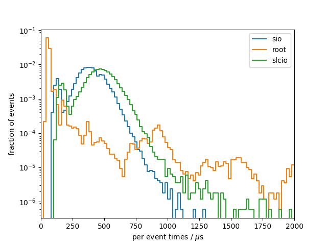
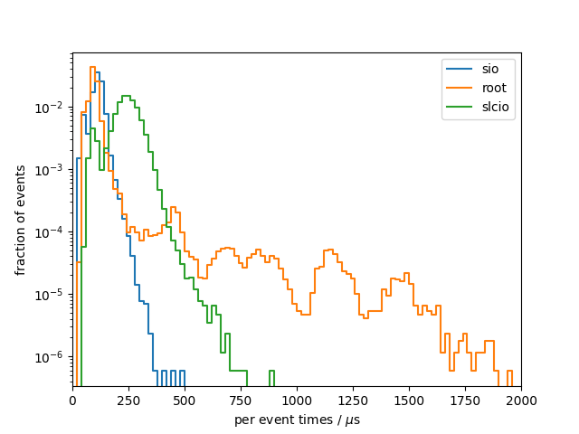

# Benchmark results
## System info
- CPU: `Intel(R) Core(TM) i7-9750H CPU @ 2.60GHz`
- Total available memory: `15989700 kB`
- ROOT version: `6.24/06`
- ROOT features `cxx17 asimage builtin_afterimage builtin_clang builtin_cling builtin_llvm dataframe davix exceptions gdml gsl_shared imt mathmore mlp minuit2 opengl pyroot pythia8 r roofit root7 rpath shared soversion sqlite ssl tmva tmva-rmva unuran vc vdt x11 xml xrootd`

## write

### sio
Results from 10 benchmark runs with 17143 events each

#### Wall times
| min [s]  | mean [s] |  max [s] |
|----------|----------|----------|
|    19.44 |    19.81 |    20.48 |

#### I/O times
|                          |   min    |   mean   |   max    |
|--------------------------|----------|----------|----------|
| total [s]                |    6.348 |    6.468 |    6.659 |
#### Setup times
|                          |   min    |   mean   |   max    |
|--------------------------|----------|----------|----------|
| total setup [ms]         |    3.470 |    4.572 |    7.177 |
| constructor [ms]         |    2.112 |    3.198 |    5.821 |
| finish [ms]              |    1.302 |    1.363 |    1.431 |
| register for write [us]  |    7.904 |    11.46 |    21.61 |
#### Per event times
|                          |   min    |   mean   |   max    |
|--------------------------|----------|----------|----------|
| median [us]              |    374.6 |    381.8 |    393.1 |
| min [us]                 |    80.97 |    82.46 |    86.05 |
| max [us]                 |    975.5 |     1111 |     1535 |
| 90 percentile [us]       |    507.2 |    517.7 |    531.5 |
| 99 percentile [us]       |    629.1 |    643.7 |    666.3 |

### root
Results from 10 benchmark runs with 17143 events each

#### Wall times
| min [s]  | mean [s] |  max [s] |
|----------|----------|----------|
|    18.02 |    18.41 |    18.90 |

#### I/O times
|                          |   min    |   mean   |   max    |
|--------------------------|----------|----------|----------|
| total [s]                |    4.584 |    4.718 |    4.862 |
#### Setup times
|                          |   min    |   mean   |   max    |
|--------------------------|----------|----------|----------|
| total setup [ms]         |    838.3 |    864.0 |    895.3 |
| constructor [ms]         |    27.02 |    30.55 |    45.89 |
| finish [ms]              |    811.1 |    833.4 |    866.6 |
| register for write [us]  |    3.148 |    3.729 |    4.491 |
#### Per event times
|                          |   min    |   mean   |   max    |
|--------------------------|----------|----------|----------|
| median [us]              |    55.55 |    58.39 |    61.01 |
| min [us]                 |    37.15 |    39.57 |    41.79 |
| max [us]                 | 9.55e+05 | 9.89e+05 | 1.01e+06 |
| 90 percentile [us]       |    78.91 |    85.32 |    96.15 |
| 99 percentile [us]       |     2246 |     2300 |     2363 |

### slcio
Results from 10 benchmark runs with 17143 events each

#### Wall times
| min [s]  | mean [s] |  max [s] |
|----------|----------|----------|
|    21.21 |    21.63 |    22.20 |

#### I/O times
|                          |   min    |   mean   |   max    |
|--------------------------|----------|----------|----------|
| total [s]                |    7.635 |    7.792 |    7.991 |
#### Setup times
|                          |   min    |   mean   |   max    |
|--------------------------|----------|----------|----------|
| total setup [ms]         |    1.024 |    1.449 |    3.070 |
| constructor [us]         |    971.2 |     1386 |     2978 |
| open file [us]           |    20.45 |    30.13 |    61.88 |
| close [us]               |    29.59 |    32.91 |    49.06 |
#### Per event times
|                          |   min    |   mean   |   max    |
|--------------------------|----------|----------|----------|
| median [us]              |    456.2 |    464.8 |    478.4 |
| min [us]                 |    113.3 |    114.9 |    117.7 |
| max [us]                 |     1084 |     1634 |     3055 |
| 90 percentile [us]       |    593.7 |    606.5 |    620.6 |
| 99 percentile [us]       |    733.2 |    754.0 |    774.5 |

### per-event comparison plot

## read

### sio
Results from 10 benchmark runs with 17143 events each

#### Wall times
| min [s]  | mean [s] |  max [s] |
|----------|----------|----------|
|    2.831 |    2.918 |    3.005 |

#### I/O times
|                          |   min    |   mean   |   max    |
|--------------------------|----------|----------|----------|
| total [s]                |    1.836 |    1.890 |    1.945 |
#### Setup times
|                          |   min    |   mean   |   max    |
|--------------------------|----------|----------|----------|
| total setup [ms]         |    2.401 |    2.830 |    5.783 |
| constructor [ms]         |    2.007 |    2.414 |    5.235 |
| open file [us]           |    383.8 |    407.7 |    538.7 |
| close file [us]          |    6.139 |    7.107 |    8.094 |
| read collection ids [ns] |    94.00 |    107.8 |    132.0 |
| get entries [ns]         |    748.0 |     1103 |     3447 |
#### Per event times
|                          |   min    |   mean   |   max    |
|--------------------------|----------|----------|----------|
| median [us]              |    109.1 |    112.1 |    115.2 |
| min [us]                 |    30.02 |    31.58 |    32.44 |
| max [us]                 |    283.5 |    347.4 |    494.0 |
| 90 percentile [us]       |    136.5 |    140.6 |    144.9 |
| 99 percentile [us]       |    175.9 |    187.2 |    200.8 |

### root
Results from 10 benchmark runs with 17143 events each

#### Wall times
| min [s]  | mean [s] |  max [s] |
|----------|----------|----------|
|    4.153 |    4.249 |    4.398 |

#### I/O times
|                          |   min    |   mean   |   max    |
|--------------------------|----------|----------|----------|
| total [s]                |    3.197 |    3.271 |    3.399 |
#### Setup times
|                          |   min    |   mean   |   max    |
|--------------------------|----------|----------|----------|
| total setup [ms]         |    720.5 |    741.5 |    787.7 |
| constructor [ns]         |    45.00 |    55.40 |    112.0 |
| open file [ms]           |    713.1 |    736.3 |    780.9 |
| close file [ms]          |    3.236 |    5.266 |    7.816 |
| read collection ids [ns] |    89.00 |    102.2 |    117.0 |
| get entries [us]         |    0.308 |    0.455 |    1.388 |
#### Per event times
|                          |   min    |   mean   |   max    |
|--------------------------|----------|----------|----------|
| median [us]              |    90.84 |    94.09 |    97.70 |
| min [us]                 |    36.69 |    38.96 |    41.03 |
| max [us]                 | 3.46e+05 | 3.55e+05 | 3.65e+05 |
| 90 percentile [us]       |    120.8 |    125.4 |    132.2 |
| 99 percentile [us]       |    689.8 |    721.7 |    743.8 |

### slcio
Results from 10 benchmark runs with 17143 events each

#### Wall times
| min [s]  | mean [s] |  max [s] |
|----------|----------|----------|
|    4.146 |    4.227 |    4.327 |

#### I/O times
|                          |   min    |   mean   |   max    |
|--------------------------|----------|----------|----------|
| total [s]                |    3.952 |    4.033 |    4.130 |
#### Setup times
|                          |   min    |   mean   |   max    |
|--------------------------|----------|----------|----------|
| total setup [ms]         |    1.178 |    1.227 |    1.281 |
| constructor [us]         |    980.9 |     1019 |     1089 |
| open file [us]           |    11.60 |    12.67 |    14.33 |
| get entries [us]         |    63.68 |    69.90 |    74.11 |
| close file [us]          |    3.281 |    3.761 |    4.647 |
| destructor [us]          |    105.0 |    121.1 |    144.9 |
#### Per event times
|                          |   min    |   mean   |   max    |
|--------------------------|----------|----------|----------|
| median [us]              |    235.4 |    240.1 |    246.2 |
| min [us]                 |    51.31 |    52.79 |    54.43 |
| max [us]                 |    606.1 |    705.6 |    899.3 |
| 90 percentile [us]       |    302.6 |    309.4 |    317.5 |
| 99 percentile [us]       |    369.9 |    381.4 |    391.1 |

### per-event comparison plot

